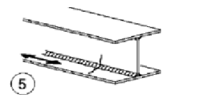

# NTC · C4.2.XIII · dettaglio 5

[Pagina estratta](../pages/ntc-128.md) · [PDF originale](../../sources/ntc.pdf#page=128)

## Classificazione riportata

100

## Descrizione e condizioni

5)
Saldatura manuale a cordoni d’angolo o
a piena penetra-zione
6)
Saldatura a piena penetra-zione manuale
o automatica eseguita da un sol lato, in
particolare per travi a cassone

## Requisiti e note

5) e 6) Deve essere assicurato un corretto contatto
tra anima e piattabanda. Il bordo dell'anima deve
essere preparato in modo da garantire una
penetrazione regolare alla radice, senza
interruzioni

> Estrazione documentale da verificare. Le categorie non sono valori di progetto pronti per il calcolo. Celle condivise e varianti non vanno separate dalle condizioni.

## Tabella completa

