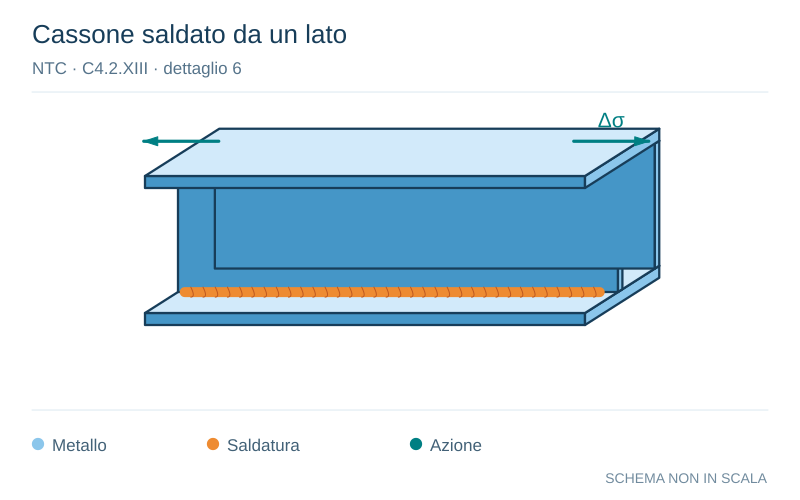

# NTC · C4.2.XIII · dettaglio 6

[Pagina estratta](../pages/ntc-128.md) · [PDF originale](../../sources/ntc.pdf#page=128)

**Cassone saldato da un lato.** Disegno vettoriale non in scala. [Apri / scarica il disegno SVG](../../assets/illustrations/ntc-128-t02-d01-02.svg).

Il blu rappresenta gli elementi metallici, l’arancio le saldature e il turchese le azioni. Simboli e proporzioni hanno funzione schematica; classi, dimensioni limite e condizioni applicabili sono quelle riportate nella fonte.

## Classificazione riportata

100

## Descrizione e condizioni

5)
Saldatura manuale a cordoni d’angolo o
a piena penetra-zione
6)
Saldatura a piena penetra-zione manuale
o automatica eseguita da un sol lato, in
particolare per travi a cassone

## Requisiti e note

5) e 6) Deve essere assicurato un corretto contatto
tra anima e piattabanda. Il bordo dell'anima deve
essere preparato in modo da garantire una
penetrazione regolare alla radice, senza
interruzioni

> Estrazione documentale da verificare. Le categorie non sono valori di progetto pronti per il calcolo. Celle condivise e varianti non vanno separate dalle condizioni.

## Contesto della classificazione

[Celle della tabella in Markdown](../tables/ntc-128-t02.md) · [Tabella nel PDF di riferimento](../../sources/ntc.pdf#page=128).
