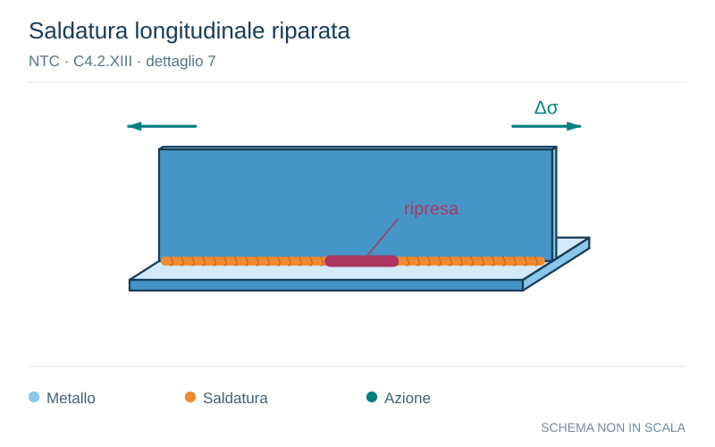

# NTC · C4.2.XIII · dettaglio 7

[Pagina estratta](../pages/ntc-128.md) · [PDF originale](../../sources/ntc.pdf#page=128)

**Saldatura longitudinale riparata.** Disegno vettoriale non in scala. [Apri / scarica il disegno SVG](../../assets/illustrations/ntc-128-t02-d02.svg).

Il blu rappresenta gli elementi metallici, l’arancio le saldature e il turchese le azioni. Simboli e proporzioni hanno funzione schematica; classi, dimensioni limite e condizioni applicabili sono quelle riportate nella fonte.

## Classificazione riportata

100

## Descrizione e condizioni

7)
Saldatura a cordoni d’angolo o a piena
penetrazione, manuale o automatica,
appartenente ai dettagli da 1) a 6)
riparata

## Requisiti e note

In caso di adozione di metodi migliorativi mediantel
molatura eseguita da tecnici qualificati, integrati dal
opportuni controlli, è possibile ripristinare la classe
originaria

> Estrazione documentale da verificare. Le categorie non sono valori di progetto pronti per il calcolo. Celle condivise e varianti non vanno separate dalle condizioni.

## Contesto della classificazione

[Celle della tabella in Markdown](../tables/ntc-128-t02.md) · [Tabella nel PDF di riferimento](../../sources/ntc.pdf#page=128).
