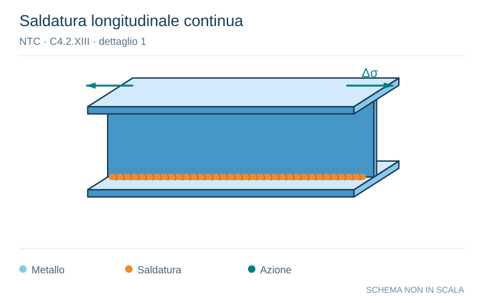

# NTC · C4.2.XIII · dettaglio 1

[Pagina estratta](../pages/ntc-128.md) · [PDF originale](../../sources/ntc.pdf#page=128)

**Saldatura longitudinale continua.** Disegno vettoriale non in scala. [Apri / scarica il disegno SVG](../../assets/illustrations/ntc-128-t02-d03-01.svg).

Il blu rappresenta gli elementi metallici, l’arancio le saldature e il turchese le azioni. Simboli e proporzioni hanno funzione schematica; classi, dimensioni limite e condizioni applicabili sono quelle riportate nella fonte.

## Classificazione riportata

125

## Descrizione e condizioni

Saldature longitudinali continue
1) Saldatura automatica a piena penetrazione
effettuata da entrambi i lati
2)
Saldatura automatica a cordoni d’angolo.
Le parti terminali dei piatti di rinforzo
devono essere verificate considerando i
dettagli 5) e 6) della tabella C4.2.XVI.a)

## Requisiti e note

1) e 2) Non sono consentite interruzioni/riprese, a
meno che la riparazione sia eseguita da un
tecnico qualificato e siano eseguiti controlli atti a
verificare la corretta esecuzione della riparazione

> Estrazione documentale da verificare. Le categorie non sono valori di progetto pronti per il calcolo. Celle condivise e varianti non vanno separate dalle condizioni.

## Contesto della classificazione

[Celle della tabella in Markdown](../tables/ntc-128-t02.md) · [Tabella nel PDF di riferimento](../../sources/ntc.pdf#page=128).
