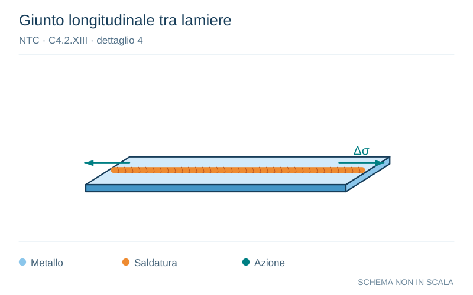

# NTC · C4.2.XIII · dettaglio 4

[Pagina estratta](../pages/ntc-128.md) · [PDF originale](../../sources/ntc.pdf#page=128)

**Giunto longitudinale tra lamiere.** Disegno vettoriale non in scala. [Apri / scarica il disegno SVG](../../assets/illustrations/ntc-128-t02-d04-02.svg).

Il blu rappresenta gli elementi metallici, l’arancio le saldature e il turchese le azioni. Simboli e proporzioni hanno funzione schematica; classi, dimensioni limite e condizioni applicabili sono quelle riportate nella fonte.

## Classificazione riportata

112

## Descrizione e condizioni

3)
Saldatura automatica a cordoni d’angolo
o a piena penetrazione effettuata da
entrambi i lati, ma contenente punti di
interruzione/ripresa.
4)
Saldatura automatica a piena
penetrazione su piatto di sostegno, non
contenente punti di interruzione/ripresa

## Requisiti e note

4) Se il dettaglio contiene punti di
interruzione/ripresa, si deve far riferimento alla
classe 100

> Estrazione documentale da verificare. Le categorie non sono valori di progetto pronti per il calcolo. Celle condivise e varianti non vanno separate dalle condizioni.

## Contesto della classificazione

[Celle della tabella in Markdown](../tables/ntc-128-t02.md) · [Tabella nel PDF di riferimento](../../sources/ntc.pdf#page=128).
