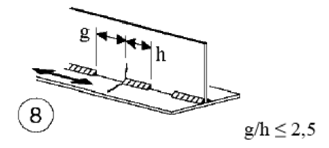

# NTC · C4.2.XIII · dettaglio 8

[Pagina estratta](../pages/ntc-128.md) · [PDF originale](../../sources/ntc.pdf#page=128)

## Classificazione riportata

80

## Descrizione e condizioni

8)
Saldatura longitudinale a cordoni d’angolo
a tratti

## Requisiti e note

∆σ riferiti alle tensioni nella piattabanda

> Estrazione documentale da verificare. Le categorie non sono valori di progetto pronti per il calcolo. Celle condivise e varianti non vanno separate dalle condizioni.

## Tabella completa

