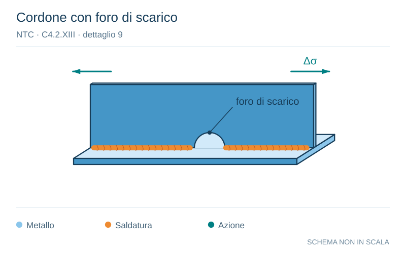

# NTC · C4.2.XIII · dettaglio 9

[Pagina estratta](../pages/ntc-128.md) · [PDF originale](../../sources/ntc.pdf#page=128)

**Cordone con foro di scarico.** Disegno vettoriale non in scala. [Apri / scarica il disegno SVG](../../assets/illustrations/ntc-128-t02-d06.svg).

Il blu rappresenta gli elementi metallici, l’arancio le saldature e il turchese le azioni. Simboli e proporzioni hanno funzione schematica; classi, dimensioni limite e condizioni applicabili sono quelle riportate nella fonte.

## Classificazione riportata

71

## Descrizione e condizioni

(6
Saldatura longitudinale a piena
penetrazione, a cordoni d’angolo e a
tratti, con lunette di scarico di altezza non
maggiore di 60 mm. Per lunette di
altezza maggiore vedere dettaglio 1)
della tabella C4.2.XV)

## Requisiti e note

Δσ riferiti alle tensioni nella piattabanda

> Estrazione documentale da verificare. Le categorie non sono valori di progetto pronti per il calcolo. Celle condivise e varianti non vanno separate dalle condizioni.

## Contesto della classificazione

[Celle della tabella in Markdown](../tables/ntc-128-t02.md) · [Tabella nel PDF di riferimento](../../sources/ntc.pdf#page=128).
