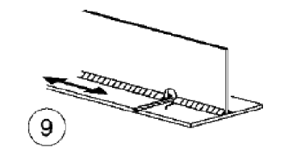
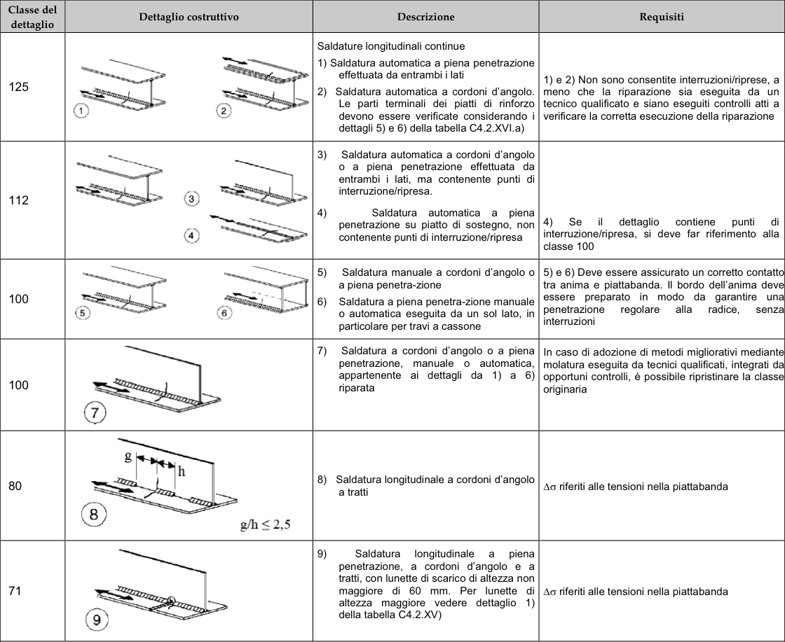

# NTC · C4.2.XIII · dettaglio 1

[Pagina estratta](../pages/ntc-128.md) · [PDF originale](../../sources/ntc.pdf#page=128)

## Classificazione riportata

71

## Descrizione e condizioni

(6
Saldatura longitudinale a piena
penetrazione, a cordoni d’angolo e a
tratti, con lunette di scarico di altezza non
maggiore di 60 mm. Per lunette di
altezza maggiore vedere dettaglio 1)
della tabella C4.2.XV)

## Requisiti e note

Δσ riferiti alle tensioni nella piattabanda

> Estrazione documentale da verificare. Le categorie non sono valori di progetto pronti per il calcolo. Celle condivise e varianti non vanno separate dalle condizioni.

## Tabella completa

