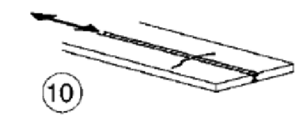

# NTC · PDF-129-T1 · dettaglio 10

[Pagina estratta](../pages/ntc-129.md) · [PDF originale](../../sources/ntc.pdf#page=129)

## Classificazione riportata

125 (a)
112 (b)
90 (c)

## Descrizione e condizioni

10)
Saldatura
longitudinale
a
piena
penetrazione

## Requisiti e note

(a) Entrambe le facce molate in direzione deglil
sforzi e controlli non distruttivi al 100%
(b) Come saldata, assenza di interruzioni/riprese
(c) Con interruzioni/riprese

> Estrazione documentale da verificare. Le categorie non sono valori di progetto pronti per il calcolo. Celle condivise e varianti non vanno separate dalle condizioni.

## Tabella completa

