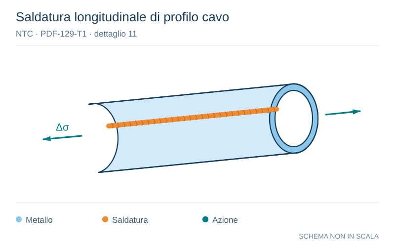

# NTC · PDF-129-T1 · dettaglio 11

[Pagina estratta](../pages/ntc-129.md) · [PDF originale](../../sources/ntc.pdf#page=129)

**Saldatura longitudinale di profilo cavo.** Disegno vettoriale non in scala. [Apri / scarica il disegno SVG](../../assets/illustrations/ntc-129-t01-d02.svg).

Il blu rappresenta gli elementi metallici, l’arancio le saldature e il turchese le azioni. Simboli e proporzioni hanno funzione schematica; classi, dimensioni limite e condizioni applicabili sono quelle riportate nella fonte.

## Classificazione riportata

140 (a)
125 (b)
90 (c)

## Descrizione e condizioni

11) Saldatura longitudinale automaticadi
composizione in sezioni cave circolari o
rettangolari,
in
assenza
!p
interruzioni/riprese

## Requisiti e note

(a) Difetti entro i limiti della UNI EN 1090.
Spessore t≤12,5 mm e controlli non distruttivi al
100%
(b) Come saldata, assenza di interruzioni/riprese
(c) Con interruzioni/riprese

> Estrazione documentale da verificare. Le categorie non sono valori di progetto pronti per il calcolo. Celle condivise e varianti non vanno separate dalle condizioni.

## Contesto della classificazione

[Celle della tabella in Markdown](../tables/ntc-129-t01.md) · [Tabella nel PDF di riferimento](../../sources/ntc.pdf#page=129).
