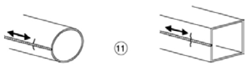
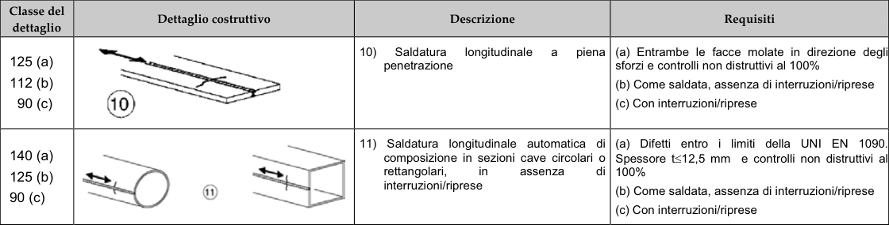

# NTC · PDF-129-T1 · dettaglio 11

[Pagina estratta](../pages/ntc-129.md) · [PDF originale](../../sources/ntc.pdf#page=129)

## Classificazione riportata

140 (a)
125 (b)
90 (c)

## Descrizione e condizioni

11) Saldatura longitudinale automaticadi
composizione in sezioni cave circolari o
rettangolari,
in
assenza
!p
interruzioni/riprese

## Requisiti e note

(a) Difetti entro i limiti della UNI EN 1090.
Spessore t≤12,5 mm e controlli non distruttivi al
100%
(b) Come saldata, assenza di interruzioni/riprese
(c) Con interruzioni/riprese

> Estrazione documentale da verificare. Le categorie non sono valori di progetto pronti per il calcolo. Celle condivise e varianti non vanno separate dalle condizioni.

## Tabella completa

