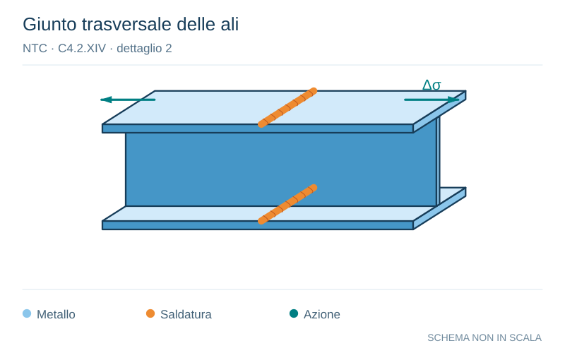

# NTC · C4.2.XIV · dettaglio 2

[Pagina estratta](../pages/ntc-129.md) · [PDF originale](../../sources/ntc.pdf#page=129)

**Giunto trasversale delle ali.** Disegno vettoriale non in scala. [Apri / scarica il disegno SVG](../../assets/illustrations/ntc-129-t02-d01-02.svg).

Il blu rappresenta gli elementi metallici, l’arancio le saldature e il turchese le azioni. Simboli e proporzioni hanno funzione schematica; classi, dimensioni limite e condizioni applicabili sono quelle riportate nella fonte.

## Classificazione riportata

112

## Descrizione e condizioni

Saldature senza piatto di sostegno
1) Giunti trasversali in piatti e lamiere
2) Giunti di anime e piattabande in travi
composte eseguiti prima dell'assemblaggio
3) Giunti trasversali completi di profili laminati,
in assenza di lunette di scarico
4)
Giunti trasversali di lamiere e piatti con
rastremazioni in larghezza e spessore con
pendenza non mag-giore di 1:4. Nelle
zone di transi-zione gli intagli nelle
saldature devono essere eliminati
Per spessori t>25 mm, si deve adot-tare una
classe ridotta del coefficiente
k = (25/t)0,2

## Requisiti e note

Saldature effettuate da entrambi i lati, molate in|
direzione degli sforzi e sottoposte a controlli non
distruttivi
Le saldature devono essere iniziate e terminate su
tacchi d'estremità, da rimuovere una voltal
completata la saldatura
I bordi esterni delle saldature devono essere
molati in direzione degli sforzi
3) Vale solo per profilati tagliati e risaldati

> Estrazione documentale da verificare. Le categorie non sono valori di progetto pronti per il calcolo. Celle condivise e varianti non vanno separate dalle condizioni.

## Contesto della classificazione

[Celle della tabella in Markdown](../tables/ntc-129-t02.md) · [Tabella nel PDF di riferimento](../../sources/ntc.pdf#page=129).
