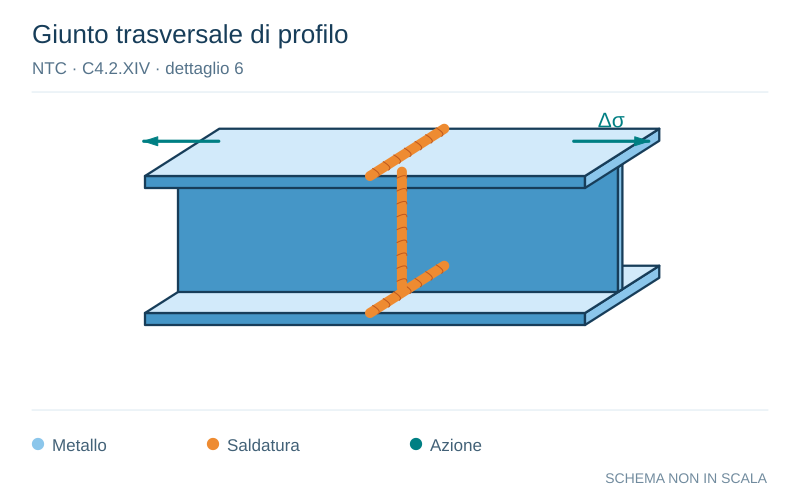

# NTC · C4.2.XIV · dettaglio 6

[Pagina estratta](../pages/ntc-129.md) · [PDF originale](../../sources/ntc.pdf#page=129)

**Giunto trasversale di profilo.** Disegno vettoriale non in scala. [Apri / scarica il disegno SVG](../../assets/illustrations/ntc-129-t02-d02-02.svg).

Il blu rappresenta gli elementi metallici, l’arancio le saldature e il turchese le azioni. Simboli e proporzioni hanno funzione schematica; classi, dimensioni limite e condizioni applicabili sono quelle riportate nella fonte.

## Classificazione riportata

90

## Descrizione e condizioni

Saldature senza piatto di sostegno
5) Giunti trasversali in piatti e lamiere
6)
Giunti trasversali completi di profili laminati,
in assenza di lunette di scarico
Giunti trasversali di lamiere e piatti con
7)
rastremazioni in larghezza e spessore con
pendenza non maggiore di 1:4.
Nelle zone di transizione gli intagli nelle
saldature devono essere eliminati
Per spessori t>25 mm, si deve adot-tare una
classe ridotta del coefficiente
ks = (25/t)0,2

## Requisiti e note

Saldature effettuate da entrambi i lati e sottoposte
a controlli non distruttivi
Sovraspessore di saldatura non maggiore del
10% della larghezza del cordone, con zone di
transizione regolari
Le saldature devono essere iniziate e terminate
su tacchi d’estremità, da rimuovere una volta
completata la saldatura
I bordi esterni delle saldature devono essere
molati in dire-zione degli sforzi
Le saldature dei dettagli 5) e 7) devono essere
eseguite in piano

> Estrazione documentale da verificare. Le categorie non sono valori di progetto pronti per il calcolo. Celle condivise e varianti non vanno separate dalle condizioni.

## Contesto della classificazione

[Celle della tabella in Markdown](../tables/ntc-129-t02.md) · [Tabella nel PDF di riferimento](../../sources/ntc.pdf#page=129).
