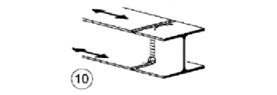
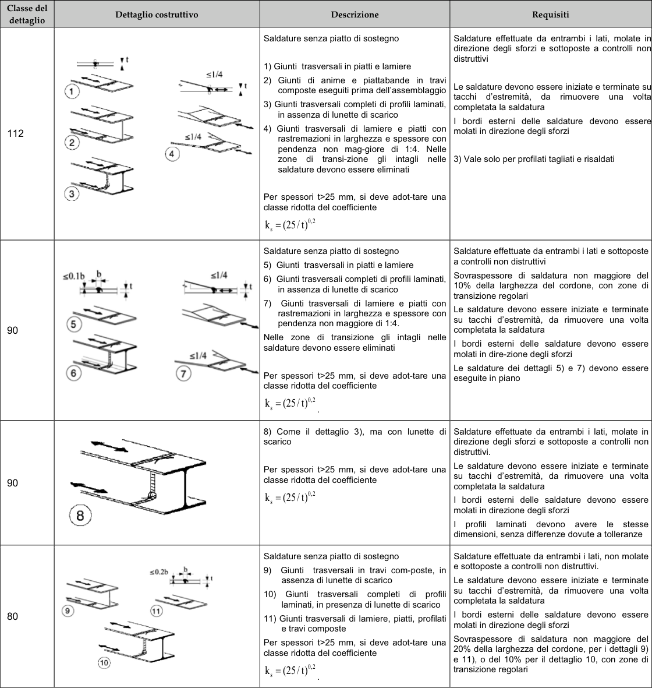

# NTC · C4.2.XIV · dettaglio 10

[Pagina estratta](../pages/ntc-129.md) · [PDF originale](../../sources/ntc.pdf#page=129)

## Classificazione riportata

80

## Descrizione e condizioni

Saldature senza piatto di sostegno
(6
Giunti trasversali in travi com-poste, in
assenza di lunette di scarico
10) Giunti trasversali completi di profili
laminati, in presenza di lunette di scarico
11) Giunti trasversali di lamiere, piatti, profilati
e travi composte
Per spessori t>25 mm, si deve adot-tare una
classe ridotta del coefficiente
ks = (25/t)0,2

## Requisiti e note

Saldature effettuate da entrambi i lati, non molate
e sottoposte a controlli non distruttivi.
Le saldature devono essere iniziate e terminate
su tacchi d’estremità, da rimuovere una volta
completata la saldatura
I bordi esterni delle saldature devono essere
molati in direzione degli sforzi
Sovraspessore di saldatura non maggiore del
20% della larghezza del cordone, per i dettagli 9)
e 11), o del 10% per il dettaglio 10, con zoñe di
transizione regolari

> Estrazione documentale da verificare. Le categorie non sono valori di progetto pronti per il calcolo. Celle condivise e varianti non vanno separate dalle condizioni.

## Tabella completa

