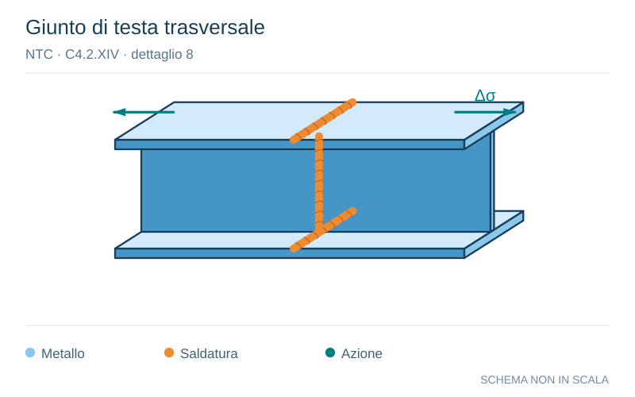

# NTC · C4.2.XIV · dettaglio 8

[Pagina estratta](../pages/ntc-129.md) · [PDF originale](../../sources/ntc.pdf#page=129)

**Giunto di testa trasversale.** Disegno vettoriale non in scala. [Apri / scarica il disegno SVG](../../assets/illustrations/ntc-129-t02-d04.svg).

Il blu rappresenta gli elementi metallici, l’arancio le saldature e il turchese le azioni. Simboli e proporzioni hanno funzione schematica; classi, dimensioni limite e condizioni applicabili sono quelle riportate nella fonte.

## Classificazione riportata

90

## Descrizione e condizioni

8) Come il dettaglio 3), ma con lunette di
scarico
Per spessori t>25 mm, si deve adot-tare una
classe ridotta del coefficiente
k = (25/t)0,.2

## Requisiti e note

Saldature effettuate da entrambi i lati, molate in
direzione degli sforzi e sottoposte a controlli non
distruttivi.
Le saldature devono essere iniziate e terminate
su tacchi d'estremità, da rimuovere una volta
completata la saldatura
I bordi esterni delle saldature devono essere
molati in direzione degli sforzi
I profili laminati devono avere le stesse
dimensioni, senza differenze dovute a tolleranze

> Estrazione documentale da verificare. Le categorie non sono valori di progetto pronti per il calcolo. Celle condivise e varianti non vanno separate dalle condizioni.

## Contesto della classificazione

[Celle della tabella in Markdown](../tables/ntc-129-t02.md) · [Tabella nel PDF di riferimento](../../sources/ntc.pdf#page=129).
