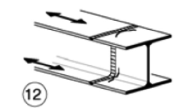

# NTC · PDF-130-T1 · dettaglio 12

[Pagina estratta](../pages/ntc-130.md) · [PDF originale](../../sources/ntc.pdf#page=130)

## Classificazione riportata

63

## Descrizione e condizioni

12)
Giunti trasversali completi di profili
laminati, in assenza di lunette di scarico

## Requisiti e note

Saldature effettuate da entrambi i lati
Le saldature devono essere iniziate e terminate
su tacchi d'estremità, da rimuovere una volta
completata la saldatura
I bordi esterni delle saldature devono essere
molati in direzione degli sforzi

> Estrazione documentale da verificare. Le categorie non sono valori di progetto pronti per il calcolo. Celle condivise e varianti non vanno separate dalle condizioni.

## Tabella completa

