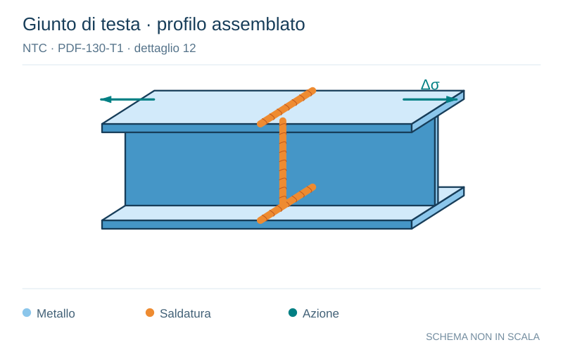

# NTC · PDF-130-T1 · dettaglio 12

[Pagina estratta](../pages/ntc-130.md) · [PDF originale](../../sources/ntc.pdf#page=130)

**Giunto di testa · profilo assemblato.** Disegno vettoriale non in scala. [Apri / scarica il disegno SVG](../../assets/illustrations/ntc-130-t01-d01.svg).

Il blu rappresenta gli elementi metallici, l’arancio le saldature e il turchese le azioni. Simboli e proporzioni hanno funzione schematica; classi, dimensioni limite e condizioni applicabili sono quelle riportate nella fonte.

## Classificazione riportata

63

## Descrizione e condizioni

12)
Giunti trasversali completi di profili
laminati, in assenza di lunette di scarico

## Requisiti e note

Saldature effettuate da entrambi i lati
Le saldature devono essere iniziate e terminate
su tacchi d'estremità, da rimuovere una volta
completata la saldatura
I bordi esterni delle saldature devono essere
molati in direzione degli sforzi

> Estrazione documentale da verificare. Le categorie non sono valori di progetto pronti per il calcolo. Celle condivise e varianti non vanno separate dalle condizioni.

## Contesto della classificazione

[Celle della tabella in Markdown](../tables/ntc-130-t01.md) · [Tabella nel PDF di riferimento](../../sources/ntc.pdf#page=130).
