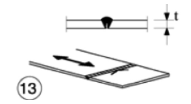

# NTC · PDF-130-T1 · dettaglio 13

[Pagina estratta](../pages/ntc-130.md) · [PDF originale](../../sources/ntc.pdf#page=130)

## Classificazione riportata

71
(36)

## Descrizione e condizioni

13) Giunti trasversali a piena penetrazione
eseguiti da un solo lato, con piena
penetrazione
controllata
mediante
opportuni controlli non distruttivi.
Per spessori t>25 mm, si deve adot-tare una
classe ridotta del coefficiente
k = (25/t)0,2
In assenza di controlli, si deve adottare la
classe 36, per qualsiasi valore di t

## Requisiti e note

Saldature senza piatto di sostegno
Le saldature devono essere iniziate e terminate su
tacchi d'estremità, da rimuovere una voltal
completata la saldatura
I bordi esterni delle saldature devono essere
molati in direzione degli sforzi

> Estrazione documentale da verificare. Le categorie non sono valori di progetto pronti per il calcolo. Celle condivise e varianti non vanno separate dalle condizioni.

## Tabella completa

