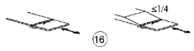
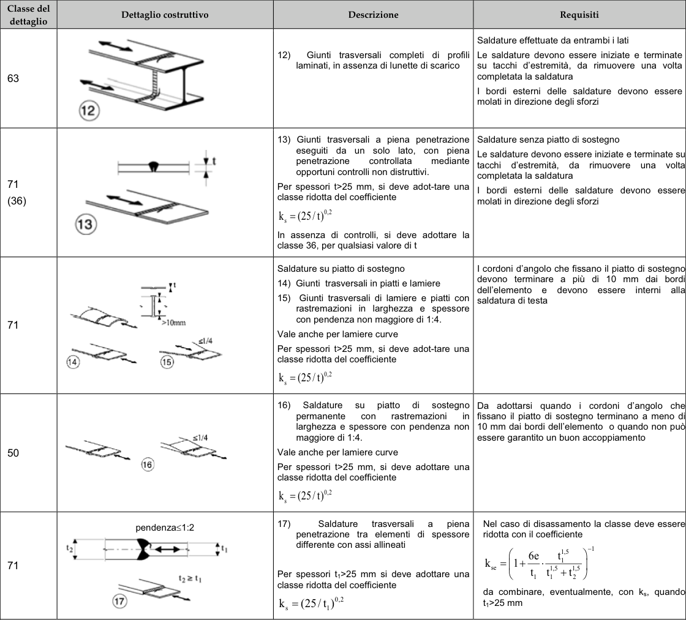

# NTC · PDF-130-T1 · dettaglio 16

[Pagina estratta](../pages/ntc-130.md) · [PDF originale](../../sources/ntc.pdf#page=130)

## Classificazione riportata

50

## Descrizione e condizioni

16)
Saldature
su piatto di sostegno
permanente
con rastremazioni in
larghezza e spessore con pendenza non
maggiore di 1:4.
Vale anche per lamiere curve
Per spessori t>25 mm, si deve adottare una
classe ridotta del coefficiente
ks = (25/t)0,2

## Requisiti e note

Da adottarsi quando i cordoni d'angolo chel
fissano il piatto di sostegno terminano a meno dil
10 mm dai bordi dell'elemento o quando non può
essere garantito un buon accoppiamento

> Estrazione documentale da verificare. Le categorie non sono valori di progetto pronti per il calcolo. Celle condivise e varianti non vanno separate dalle condizioni.

## Tabella completa

