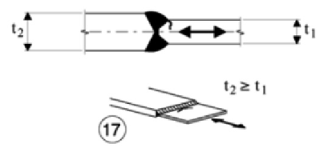

# NTC · PDF-130-T1 · dettaglio 17

[Pagina estratta](../pages/ntc-130.md) · [PDF originale](../../sources/ntc.pdf#page=130)

## Classificazione riportata

71

## Descrizione e condizioni

17)
Saldature trasversali
piena
penetrazione tra elementi di spessore
differente con assi allineati
Per spessori t1>25 mm si deve adottare una
classe ridotta del coefficiente
ks = (25/t1)0,2

## Requisiti e note

Nel caso di disassamento la classe deve essere
ridotta con il coefficiente
6e
kse
1+
1,5
t1
da combinare, eventualmente, con ks, quando
t1>25 mm

> Estrazione documentale da verificare. Le categorie non sono valori di progetto pronti per il calcolo. Celle condivise e varianti non vanno separate dalle condizioni.

## Tabella completa

