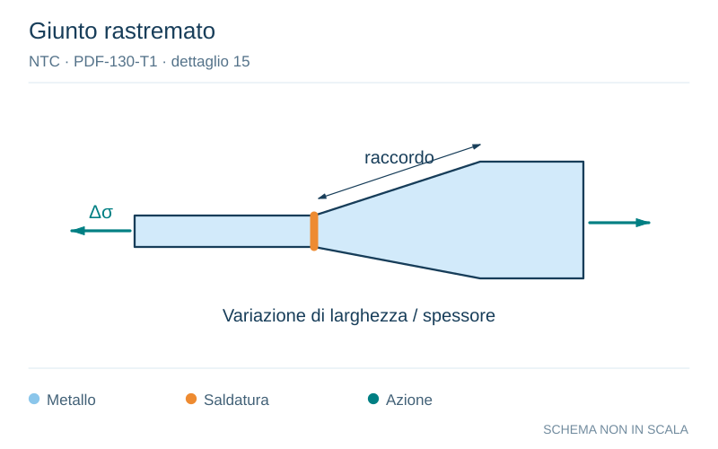

# NTC · PDF-130-T1 · dettaglio 15

[Pagina estratta](../pages/ntc-130.md) · [PDF originale](../../sources/ntc.pdf#page=130)

**Giunto rastremato.** Disegno vettoriale non in scala. [Apri / scarica il disegno SVG](../../assets/illustrations/ntc-130-t01-d05-02.svg).

Il blu rappresenta gli elementi metallici, l’arancio le saldature e il turchese le azioni. Simboli e proporzioni hanno funzione schematica; classi, dimensioni limite e condizioni applicabili sono quelle riportate nella fonte.

## Classificazione riportata

71

## Descrizione e condizioni

Saldature su piatto di sostegno
14) Giunti trasversali in piatti e lamiere
15) Giunti trasversali di lamiere e piatti con
rastremazioni in larghezza e spessore
con pendenza non maggiore di 1:4.
Vale anche per lamiere curve
Per spessori t>25 mm, si deve adot-tare una
classe ridotta del coefficiente
ks = (25/t)0,2

## Requisiti e note

I cordoni d’angolo che fissano il piatto di sostegno
devono terminare a più di 10 mm dai bordil
dell'elemento e devono essere interni allal
saldatura di testa

> Estrazione documentale da verificare. Le categorie non sono valori di progetto pronti per il calcolo. Celle condivise e varianti non vanno separate dalle condizioni.

## Contesto della classificazione

[Celle della tabella in Markdown](../tables/ntc-130-t01.md) · [Tabella nel PDF di riferimento](../../sources/ntc.pdf#page=130).
