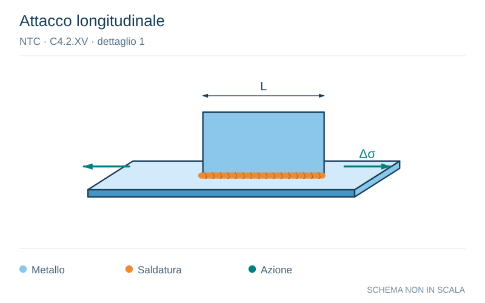

# NTC · C4.2.XV · dettaglio 1

[Pagina estratta](../pages/ntc-130.md) · [PDF originale](../../sources/ntc.pdf#page=130)

**Attacco longitudinale.** Disegno vettoriale non in scala. [Apri / scarica il disegno SVG](../../assets/illustrations/ntc-130-t02-d01.svg).

Il blu rappresenta gli elementi metallici, l’arancio le saldature e il turchese le azioni. Simboli e proporzioni hanno funzione schematica; classi, dimensioni limite e condizioni applicabili sono quelle riportate nella fonte.

## Classificazione riportata

80 (a)
71 (b)
63 (c)
56 (d)

## Descrizione e condizioni

Attacchi saldati longitudinali
1) La classe del dettaglio dipende dalla
lunghezza dell'attacco
(a) L ≤ 50 mm
(b) 50 < L ≤ 80 mm
(c) 80 < L ≤ 100 mm
(d) L > 100 mm

## Requisiti e note

Spessore dell'attacco minore della sua altezza. In
caso contrario vedi dettagli 5 e 6

> Estrazione documentale da verificare. Le categorie non sono valori di progetto pronti per il calcolo. Celle condivise e varianti non vanno separate dalle condizioni.

## Contesto della classificazione

[Celle della tabella in Markdown](../tables/ntc-130-t02.md) · [Tabella nel PDF di riferimento](../../sources/ntc.pdf#page=130).
