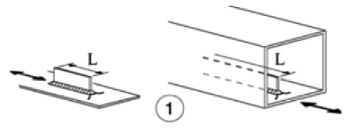

# NTC · C4.2.XV · dettaglio 1

[Pagina estratta](../pages/ntc-130.md) · [PDF originale](../../sources/ntc.pdf#page=130)

## Classificazione riportata

80 (a)
71 (b)
63 (c)
56 (d)

## Descrizione e condizioni

Attacchi saldati longitudinali
1) La classe del dettaglio dipende dalla
lunghezza dell'attacco
(a) L ≤ 50 mm
(b) 50 < L ≤ 80 mm
(c) 80 < L ≤ 100 mm
(d) L > 100 mm

## Requisiti e note

Spessore dell'attacco minore della sua altezza. In
caso contrario vedi dettagli 5 e 6

> Estrazione documentale da verificare. Le categorie non sono valori di progetto pronti per il calcolo. Celle condivise e varianti non vanno separate dalle condizioni.

## Tabella completa

