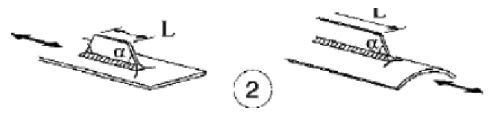

# NTC · C4.2.XV · dettaglio 2

[Pagina estratta](../pages/ntc-130.md) · [PDF originale](../../sources/ntc.pdf#page=130)

## Classificazione riportata

71

## Descrizione e condizioni

2) Attacchi saldati longitudinali a piatti o tubi
con L>100 m e α<45°

## Requisiti e note

> Estrazione documentale da verificare. Le categorie non sono valori di progetto pronti per il calcolo. Celle condivise e varianti non vanno separate dalle condizioni.

## Tabella completa

