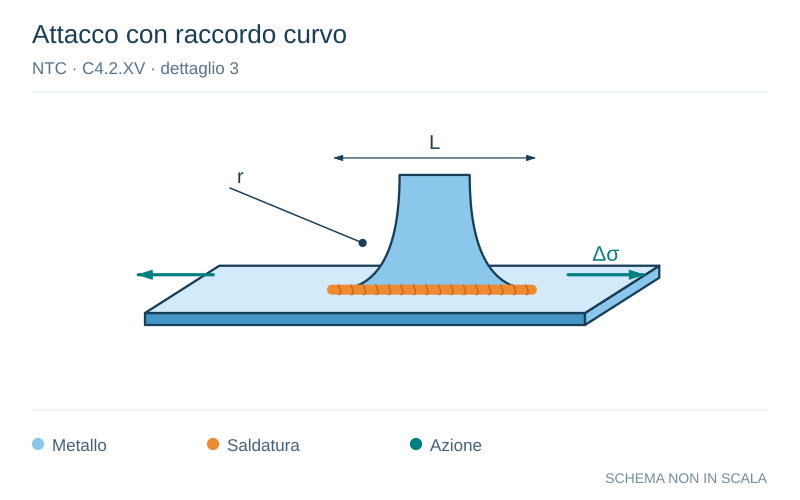

# NTC · C4.2.XV · dettaglio 3

[Pagina estratta](../pages/ntc-130.md) · [PDF originale](../../sources/ntc.pdf#page=130)

**Attacco con raccordo curvo.** Disegno vettoriale non in scala. [Apri / scarica il disegno SVG](../../assets/illustrations/ntc-130-t02-d03.svg).

Il blu rappresenta gli elementi metallici, l’arancio le saldature e il turchese le azioni. Simboli e proporzioni hanno funzione schematica; classi, dimensioni limite e condizioni applicabili sono quelle riportate nella fonte.

## Classificazione riportata

80

## Descrizione e condizioni

3) Fazzoletti d'attacco saldati a piatti o tubi
con cordoni d'angolo longitudinali e dotati
di raccordo di transizione terminale di
raggio r.
La parte terminale dei cordoni deve essere
rinforzata, cioè a piena penetrazione, per una
lunghezza maggiore di r.
r>150 mm

## Requisiti e note

Raccordo di transizione di raggio r realizzato con
taglio meccanico o a gas realizzato prima dellal
saldatura del faz-zoletto. Al termine della salda-
tura, la parte terminale deve essere molata in
direzione della freccia per eliminare completa-
mente la punta della saldatura

> Estrazione documentale da verificare. Le categorie non sono valori di progetto pronti per il calcolo. Celle condivise e varianti non vanno separate dalle condizioni.

## Contesto della classificazione

[Celle della tabella in Markdown](../tables/ntc-130-t02.md) · [Tabella nel PDF di riferimento](../../sources/ntc.pdf#page=130).
