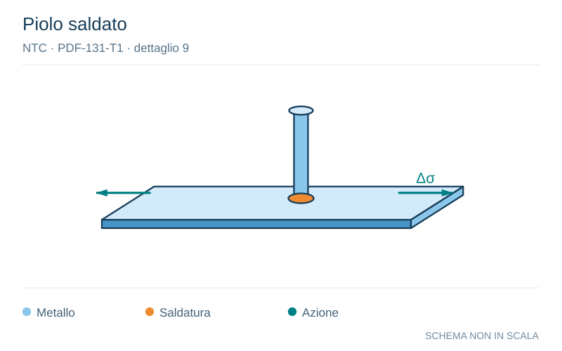

# NTC · PDF-131-T1 · dettaglio 9

[Pagina estratta](../pages/ntc-131.md) · [PDF originale](../../sources/ntc.pdf#page=131)

**Piolo saldato.** Disegno vettoriale non in scala. [Apri / scarica il disegno SVG](../../assets/illustrations/ntc-131-t01-d01.svg).

Il blu rappresenta gli elementi metallici, l’arancio le saldature e il turchese le azioni. Simboli e proporzioni hanno funzione schematica; classi, dimensioni limite e condizioni applicabili sono quelle riportate nella fonte.

## Classificazione riportata

80

## Descrizione e condizioni

9) Effetto della saldatura del piolo sul
materiale base della piastra

## Requisiti e note

> Estrazione documentale da verificare. Le categorie non sono valori di progetto pronti per il calcolo. Celle condivise e varianti non vanno separate dalle condizioni.

## Contesto della classificazione

[Celle della tabella in Markdown](../tables/ntc-131-t01.md) · [Tabella nel PDF di riferimento](../../sources/ntc.pdf#page=131).
