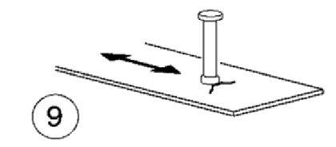

# NTC · PDF-131-T1 · dettaglio 9

[Pagina estratta](../pages/ntc-131.md) · [PDF originale](../../sources/ntc.pdf#page=131)

## Classificazione riportata

80

## Descrizione e condizioni

9) Effetto della saldatura del piolo sul
materiale base della piastra

## Requisiti e note

> Estrazione documentale da verificare. Le categorie non sono valori di progetto pronti per il calcolo. Celle condivise e varianti non vanno separate dalle condizioni.

## Tabella completa

