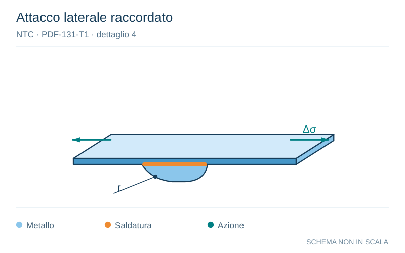

# NTC · PDF-131-T1 · dettaglio 4

[Pagina estratta](../pages/ntc-131.md) · [PDF originale](../../sources/ntc.pdf#page=131)

**Attacco laterale raccordato.** Disegno vettoriale non in scala. [Apri / scarica il disegno SVG](../../assets/illustrations/ntc-131-t01-d02.svg).

Il blu rappresenta gli elementi metallici, l’arancio le saldature e il turchese le azioni. Simboli e proporzioni hanno funzione schematica; classi, dimensioni limite e condizioni applicabili sono quelle riportate nella fonte.

## Classificazione riportata

90 (a)
71 (b)
50 (c)

## Descrizione e condizioni

4) Fazzoletti d’attacco saldati a un lato di un
piatto o della piattabanda di una trave e
dotati di raccordo di transizione di raggio r.
La lunghezza L deve essere valutata come
per i dettagli 1), 2) e 3).
La stessa classificazione può essere adottata
anche per piattabande saldate dotate di
raccordo di transizione di raggio r.
(a) r ≥ L/3 o r >150 mm
(b) L/3 >r ≥ L/6
(c) r < L/6

## Requisiti e note

Raccordo di transizione di raggio r realizzato con
taglio meccanico o a gas realizzato prima della
saldatura del fazzoletto. Al termine della saldatura,
la parte terminale deve essere molata in direzione
deila freccia per eliminare completamente la puntal
della saldatura

> Estrazione documentale da verificare. Le categorie non sono valori di progetto pronti per il calcolo. Celle condivise e varianti non vanno separate dalle condizioni.

## Contesto della classificazione

[Celle della tabella in Markdown](../tables/ntc-131-t01.md) · [Tabella nel PDF di riferimento](../../sources/ntc.pdf#page=131).
