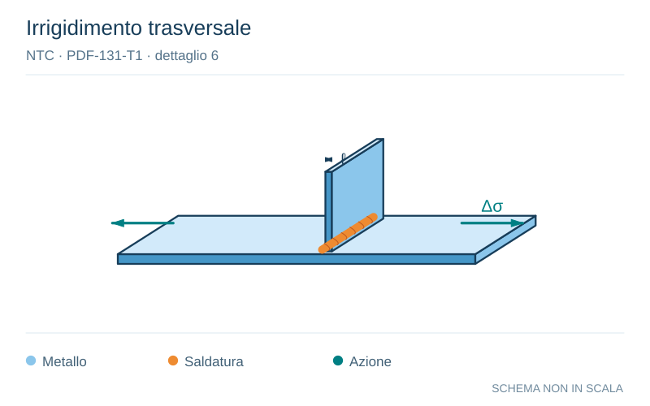

# NTC · PDF-131-T1 · dettaglio 6

[Pagina estratta](../pages/ntc-131.md) · [PDF originale](../../sources/ntc.pdf#page=131)

**Irrigidimento trasversale.** Disegno vettoriale non in scala. [Apri / scarica il disegno SVG](../../assets/illustrations/ntc-131-t01-d04-01.svg).

Il blu rappresenta gli elementi metallici, l’arancio le saldature e il turchese le azioni. Simboli e proporzioni hanno funzione schematica; classi, dimensioni limite e condizioni applicabili sono quelle riportate nella fonte.

## Classificazione riportata

80 (a)
71 (b)

## Descrizione e condizioni

Attacchi trasversali
6) Saldati a una piastra
7) Nervature verticali saldate a un profilo o a
una trave composta
8) Diagrammi di travi a cassone composte,
saldati all'anima o alla piattabanda
(a) l≤ 50 mm
(b) 50< l≤ 80 mm
Le classi sono valide anche per nervature
anulari

## Requisiti e note

6) e 7) Le parti terminali delle saldature devono
essere molate accuratamente per eliminare tutte
le rientranze presenti
7) Se la nervatura termina nell'anima, ∆σ deve
essere calcolato usando le tensioni principali

> Estrazione documentale da verificare. Le categorie non sono valori di progetto pronti per il calcolo. Celle condivise e varianti non vanno separate dalle condizioni.

## Contesto della classificazione

[Celle della tabella in Markdown](../tables/ntc-131-t01.md) · [Tabella nel PDF di riferimento](../../sources/ntc.pdf#page=131).
