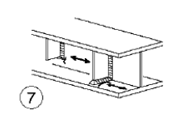
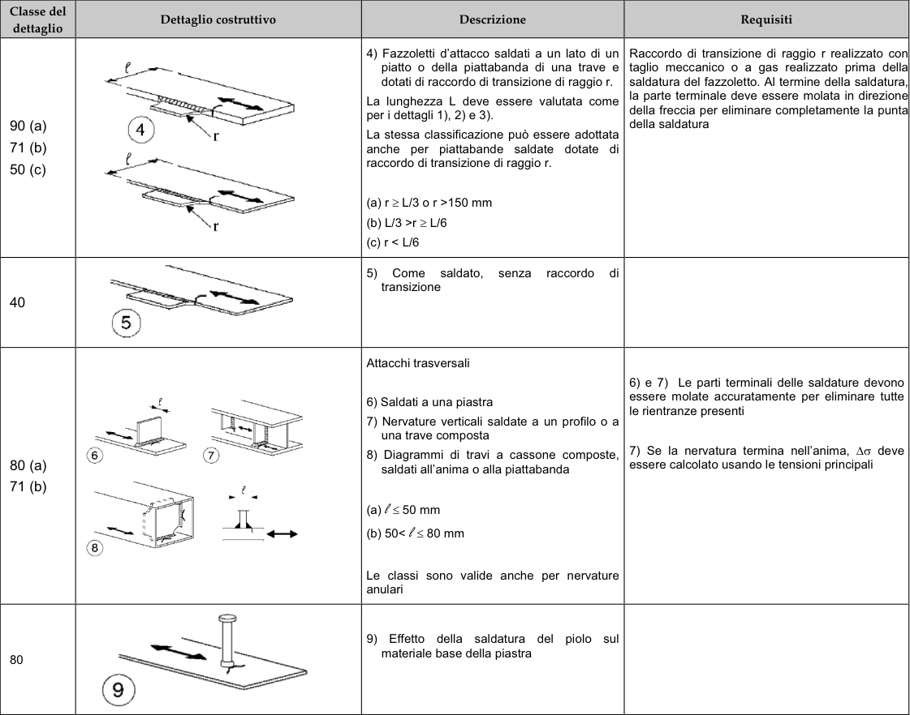

# NTC · PDF-131-T1 · dettaglio 7

[Pagina estratta](../pages/ntc-131.md) · [PDF originale](../../sources/ntc.pdf#page=131)

## Classificazione riportata

80 (a)
71 (b)

## Descrizione e condizioni

Attacchi trasversali
6) Saldati a una piastra
7) Nervature verticali saldate a un profilo o a
una trave composta
8) Diagrammi di travi a cassone composte,
saldati all'anima o alla piattabanda
(a) l≤ 50 mm
(b) 50< l≤ 80 mm
Le classi sono valide anche per nervature
anulari

## Requisiti e note

6) e 7) Le parti terminali delle saldature devono
essere molate accuratamente per eliminare tutte
le rientranze presenti
7) Se la nervatura termina nell'anima, ∆σ deve
essere calcolato usando le tensioni principali

> Estrazione documentale da verificare. Le categorie non sono valori di progetto pronti per il calcolo. Celle condivise e varianti non vanno separate dalle condizioni.

## Tabella completa

