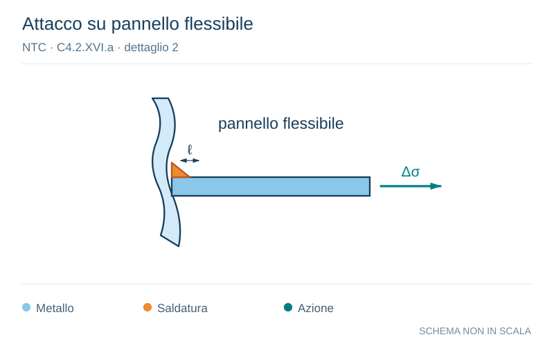

# NTC · C4.2.XVI.a · dettaglio 2

[Pagina estratta](../pages/ntc-131.md) · [PDF originale](../../sources/ntc.pdf#page=131)

**Attacco su pannello flessibile.** Disegno vettoriale non in scala. [Apri / scarica il disegno SVG](../../assets/illustrations/ntc-131-t02-d02.svg).

Il blu rappresenta gli elementi metallici, l’arancio le saldature e il turchese le azioni. Simboli e proporzioni hanno funzione schematica; classi, dimensioni limite e condizioni applicabili sono quelle riportate nella fonte.

## Classificazione riportata

80 (a)
71 (b)
63 (c)
56 (d)
50 (e)
45 (f)
40 (g)

## Descrizione e condizioni

Giunti a croce o a T
1) Lesioni al piede della saldatura in giunti a
piena penetrazione o a
parziale
penetrazione
2) Lesione al piede della saldatura a partire
dal bordo del piatto caricato, in presenza
di picchi locali di tensione nelle parti
terminali della saldatura dovuti alla
deformabilità del pannello
(a) θ ≤ 50 mm e t qualsiasi
(b) 50< l≤ 80 mm e t qualsiasi
(c) 80< l ≤ 100 mm e t qualsiasi
(d) 100< l ≤ 120 mm e t qualsiasi
(d) l>120 mm e t ≤ 20 mm
(e) 120< l ≤ 200 mm e t >20 mm
(e) l>200 mm e 20 <t ≤ 30 mm
(f) 200< l ≤ 300 mm e t >30 mm
(f) l>300 mm e 30< t ≤ 50 mm
(g) l>300 mm e t >50 mm

## Requisiti e note

1) II giunto deve essere controllato: le
discontinuità e i disallineamenti devono essere
conformi alle tolleranze della UNI EN 1090
2) Nel calcolo di ∆σ si deve far riferimento al
valore di picco delle tensioni, mediante un
opportuno fattore di concentrazione degli sforzi k
1) e 2) Il disallineamento dei piatti caricati non
deve superare il 15% dello spessore della piastra
intermedia

> Estrazione documentale da verificare. Le categorie non sono valori di progetto pronti per il calcolo. Celle condivise e varianti non vanno separate dalle condizioni.

## Contesto della classificazione

[Celle della tabella in Markdown](../tables/ntc-131-t02.md) · [Tabella nel PDF di riferimento](../../sources/ntc.pdf#page=131).
