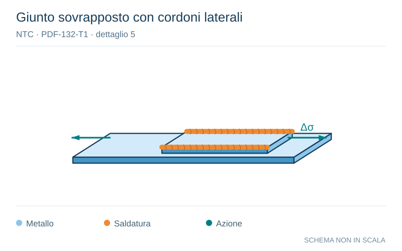

# NTC · PDF-132-T1 · dettaglio 5

[Pagina estratta](../pages/ntc-132.md) · [PDF originale](../../sources/ntc.pdf#page=132)

**Giunto sovrapposto con cordoni laterali.** Disegno vettoriale non in scala. [Apri / scarica il disegno SVG](../../assets/illustrations/ntc-132-t01-d01.svg).

Il blu rappresenta gli elementi metallici, l’arancio le saldature e il turchese le azioni. Simboli e proporzioni hanno funzione schematica; classi, dimensioni limite e condizioni applicabili sono quelle riportate nella fonte.

## Classificazione riportata

45*

## Descrizione e condizioni

Giunzioni a sovrapposizione
4) Giunzione a sovrapposizione a cordoni
d’angolo(verifica
degli
elementi
sovrapposti)

## Requisiti e note

∆σ è riferito agli elementi sovrapposti
Le saldature devono terminare a più di 10 mm dal
bordo della piastra.
Le verifiche a fatica della saldatura per tensioni
tangen-ziali devono essere effettuate
in
riferimento al dettaglio 8 (Tabella C4.2.XVI.b)

> Estrazione documentale da verificare. Le categorie non sono valori di progetto pronti per il calcolo. Celle condivise e varianti non vanno separate dalle condizioni.

## Contesto della classificazione

[Celle della tabella in Markdown](../tables/ntc-132-t01.md) · [Tabella nel PDF di riferimento](../../sources/ntc.pdf#page=132).
