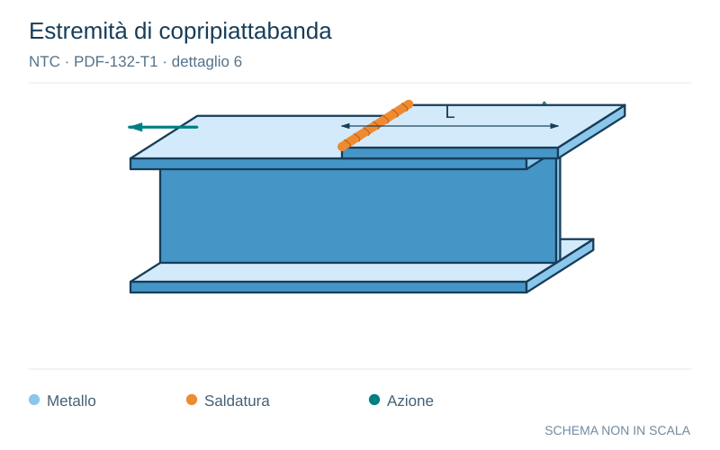

# NTC · PDF-132-T1 · dettaglio 6

[Pagina estratta](../pages/ntc-132.md) · [PDF originale](../../sources/ntc.pdf#page=132)

**Estremità di copripiattabanda.** Disegno vettoriale non in scala. [Apri / scarica il disegno SVG](../../assets/illustrations/ntc-132-t01-d02.svg).

Il blu rappresenta gli elementi metallici, l’arancio le saldature e il turchese le azioni. Simboli e proporzioni hanno funzione schematica; classi, dimensioni limite e condizioni applicabili sono quelle riportate nella fonte.

## Classificazione riportata

56* (a)
50 (b)
45 (c)
40 (d)
36 (e)

## Descrizione e condizioni

Coprigiunti di travi e travi composte
6) Zone terminali di coprigiunti saldati singoli
o multipli, con o senza cordoni terminali
trasversali
(a) t< t e t ≤ 20 mm
(b) tc< t e 20 < t ≤ 30 mm
(b) tc≥ t e t ≤ 20 mm
(c) tc< t e 30 < t ≤ 50 mm
(c) tc≥ t e 20 < t ≤ 30 mm
(d) tc< t e t >50 mm
(d) tc≥ t e 30 < t ≤ 50 mm
(e) tc≥ t et >50 mm

## Requisiti e note

Se il coprigiunto è più largo della flangia occorre
eseguire un cordone terminale trasversale, che
deve essere accuratamente molato per eliminare
le incisioni marginali
La lunghezza minima del coprigiunto è 300 mm

> Estrazione documentale da verificare. Le categorie non sono valori di progetto pronti per il calcolo. Celle condivise e varianti non vanno separate dalle condizioni.

## Contesto della classificazione

[Celle della tabella in Markdown](../tables/ntc-132-t01.md) · [Tabella nel PDF di riferimento](../../sources/ntc.pdf#page=132).
