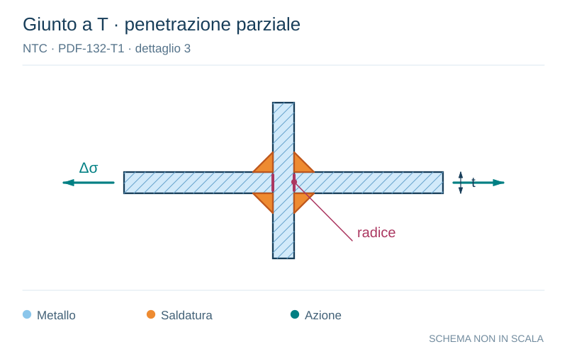

# NTC · PDF-132-T1 · dettaglio 3

[Pagina estratta](../pages/ntc-132.md) · [PDF originale](../../sources/ntc.pdf#page=132)

**Giunto a T · penetrazione parziale.** Disegno vettoriale non in scala. [Apri / scarica il disegno SVG](../../assets/illustrations/ntc-132-t01-d03.svg).

Il blu rappresenta gli elementi metallici, l’arancio le saldature e il turchese le azioni. Simboli e proporzioni hanno funzione schematica; classi, dimensioni limite e condizioni applicabili sono quelle riportate nella fonte.

## Classificazione riportata

36*

## Descrizione e condizioni

Giunti a croce o a T
3) Lesione alla radice della saldatura in giunti
a T a cordoni d'angolo, a parziale
penetrazione e a parziale penetrazione
equivalente alla piena penetrazione

## Requisiti e note

Nelle saldature a parziale penetrazione sono
richieste due verifiche: la prima riguardo alle
lesioni alla radice della saldatura deve essere
riferita alla classe 36* per Δσ e alla classe 80 per
∆τ, la seconda riguardo alle lesioni al piede della
saldatura nel piatto caricato deve essere riferita
alle classi dei dettagli 1 e 2 della presente tabella
Il disallineamento dei piatti caricati non deve
superare il 15% dello spessore della piastra
intermedia

> Estrazione documentale da verificare. Le categorie non sono valori di progetto pronti per il calcolo. Celle condivise e varianti non vanno separate dalle condizioni.

## Contesto della classificazione

[Celle della tabella in Markdown](../tables/ntc-132-t01.md) · [Tabella nel PDF di riferimento](../../sources/ntc.pdf#page=132).
