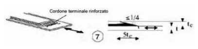
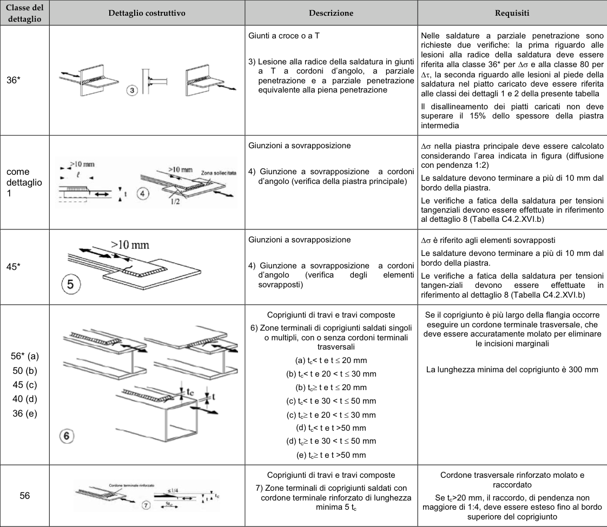

# NTC · PDF-132-T1 · dettaglio 7

[Pagina estratta](../pages/ntc-132.md) · [PDF originale](../../sources/ntc.pdf#page=132)

## Classificazione riportata

56

## Descrizione e condizioni

Coprigiunti di travi e travi composte
7) Zone terminali di coprigiunti saldati con
cordone terminale rinforzato di lunghezza
minima 5 tc

## Requisiti e note

Cordone trasversale rinforzato molato e
raccordato
Se t>20 mm, il raccordo, di pendenza non
maggiore di 1:4, deve essere esteso fino al bordo
superiore del coprigiunto

> Estrazione documentale da verificare. Le categorie non sono valori di progetto pronti per il calcolo. Celle condivise e varianti non vanno separate dalle condizioni.

## Tabella completa

