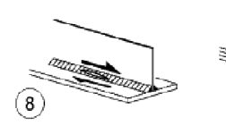
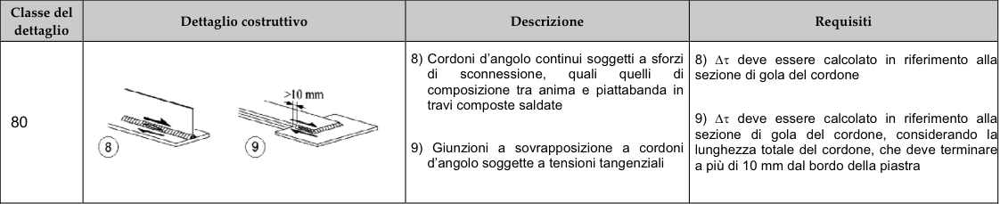

# NTC · C4.2.XVI.b · dettaglio 8

[Pagina estratta](../pages/ntc-132.md) · [PDF originale](../../sources/ntc.pdf#page=132)

## Classificazione riportata

80

## Descrizione e condizioni

8) Cordoni d'angolo continui soggetti a sforzi
!p
sconnessione, quali quelli di
composizione tra anima e piattabanda in
travi composte saldate
9) Giunzioni a sovrapposizione a cordoni
d’angolo soggette a tensioni tangenziali

## Requisiti e note

8) ∆τ deve essere calcolato in riferimento allal
sezione di gola del cordone
9) ∆τ deve essere calcolato in riferimento allal
sezione di gola del cordone, considerando lal
lunghezza totale del cordone, che deve terminarel
a più di 10 mm dal bordo della piastra

> Estrazione documentale da verificare. Le categorie non sono valori di progetto pronti per il calcolo. Celle condivise e varianti non vanno separate dalle condizioni.

## Tabella completa

