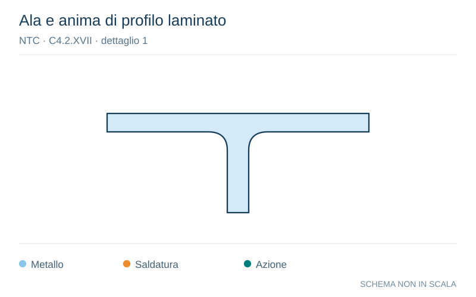

# NTC · C4.2.XVII · dettaglio 1

[Pagina estratta](../pages/ntc-132.md) · [PDF originale](../../sources/ntc.pdf#page=132)

**Ala e anima di profilo laminato.** Disegno vettoriale non in scala. [Apri / scarica il disegno SVG](../../assets/illustrations/ntc-132-t03-d01.svg).

Il blu rappresenta gli elementi metallici, l’arancio le saldature e il turchese le azioni. Simboli e proporzioni hanno funzione schematica; classi, dimensioni limite e condizioni applicabili sono quelle riportate nella fonte.

## Classificazione riportata

160

## Descrizione e condizioni

1) Sezioni laminate ad I o H

## Requisiti e note

La classe è relativa ai delta di compressione
verticali ∆σvert indotti nell'anima dai carichi ruota

> Estrazione documentale da verificare. Le categorie non sono valori di progetto pronti per il calcolo. Celle condivise e varianti non vanno separate dalle condizioni.

## Contesto della classificazione

[Celle della tabella in Markdown](../tables/ntc-132-t03.md) · [Tabella nel PDF di riferimento](../../sources/ntc.pdf#page=132).
