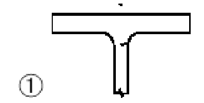
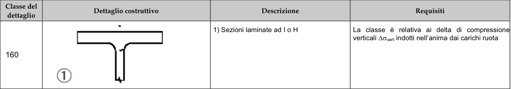

# NTC · C4.2.XVII · dettaglio 1

[Pagina estratta](../pages/ntc-132.md) · [PDF originale](../../sources/ntc.pdf#page=132)

## Classificazione riportata

160

## Descrizione e condizioni

1) Sezioni laminate ad I o H

## Requisiti e note

La classe è relativa ai delta di compressione
verticali ∆σvert indotti nell'anima dai carichi ruota

> Estrazione documentale da verificare. Le categorie non sono valori di progetto pronti per il calcolo. Celle condivise e varianti non vanno separate dalle condizioni.

## Tabella completa

