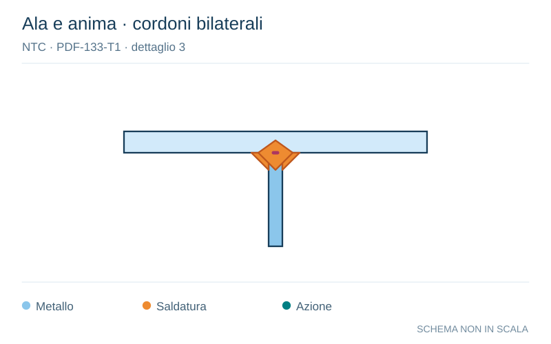

# NTC · PDF-133-T1 · dettaglio 3

[Pagina estratta](../pages/ntc-133.md) · [PDF originale](../../sources/ntc.pdf#page=133)

**Ala e anima · cordoni bilaterali.** Disegno vettoriale non in scala. [Apri / scarica il disegno SVG](../../assets/illustrations/ntc-133-t01-d02.svg).

Il blu rappresenta gli elementi metallici, l’arancio le saldature e il turchese le azioni. Simboli e proporzioni hanno funzione schematica; classi, dimensioni limite e condizioni applicabili sono quelle riportate nella fonte.

## Classificazione riportata

36*

## Descrizione e condizioni

a piena penetrazione equivalente a
parziale penetrazione

## Requisiti e note

3) Saldatura a T a parziale penetrazione o La classe è relativa ai delta di compressione
verticali ∆σvert indotti nella sezione di gola della
saldatura dai carichi ruota

> Estrazione documentale da verificare. Le categorie non sono valori di progetto pronti per il calcolo. Celle condivise e varianti non vanno separate dalle condizioni.

## Contesto della classificazione

[Celle della tabella in Markdown](../tables/ntc-133-t01.md) · [Tabella nel PDF di riferimento](../../sources/ntc.pdf#page=133).
