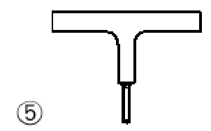

# NTC · PDF-133-T1 · dettaglio 5

[Pagina estratta](../pages/ntc-133.md) · [PDF originale](../../sources/ntc.pdf#page=133)

## Classificazione riportata

71

## Descrizione e condizioni

5) Saldatura a T a piena penetrazione tra
anima e piattabanda a T

## Requisiti e note

La classe è relativa ai delta di compressione
verticali Δσvert indotti nell'anima dai carichi ruota

> Estrazione documentale da verificare. Le categorie non sono valori di progetto pronti per il calcolo. Celle condivise e varianti non vanno separate dalle condizioni.

## Tabella completa

