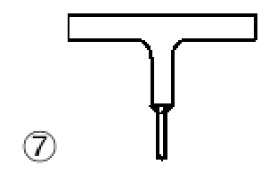

# NTC · PDF-133-T1 · dettaglio ntc-133-t01-d06

[Pagina estratta](../pages/ntc-133.md) · [PDF originale](../../sources/ntc.pdf#page=133)

## Classificazione riportata

36*

## Descrizione e condizioni

anima e piattabanda a T

## Requisiti e note

al  cl i c  s  a co o    c sn
verticali ∆σvert indotti nella sezione di gola dellal
saldatura dai carichi ruota

> Estrazione documentale da verificare. Le categorie non sono valori di progetto pronti per il calcolo. Celle condivise e varianti non vanno separate dalle condizioni.

## Tabella completa

