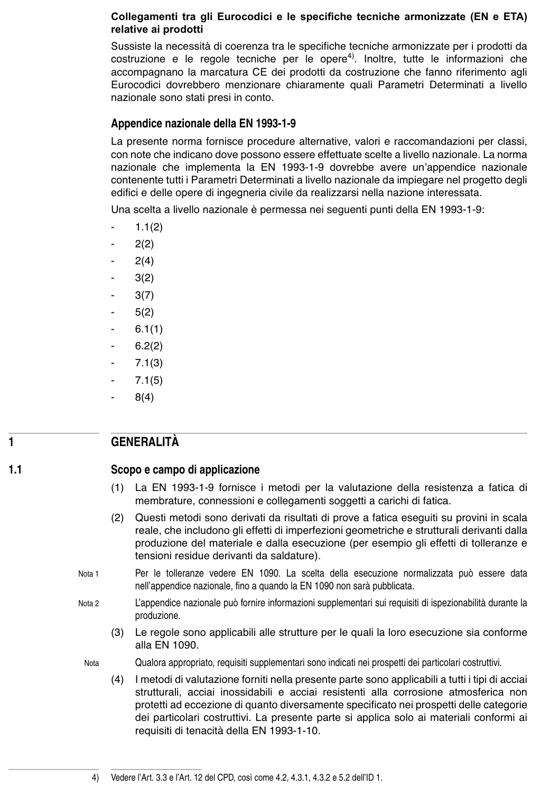

# 1 — Generalità, definizioni e simboli — pagina PDF 8

Fonte: [UNI EN 1993-1-9:2005 — Fatica](../../sources/ec3.pdf#page=8). Pagina stampata: 3.

> Formule, simboli e associazioni delle tabelle non sono convalidati per il calcolo.

## Testo estratto

Collegamenti tra gli Eurocodici e le specifiche tecniche armonizzate (EN e ETA) relative ai prodotti

```text
                    Sussiste la necessità di coerenza tra le specifiche tecniche armonizzate per i prodotti da
                     costruzione e  le regole tecniche per  le opere4).  Inoltre,  tutte  le informazioni che
                 accompagnano la marcatura CE dei prodotti da costruzione che fanno riferimento agli
                     Eurocodici dovrebbero menzionare chiaramente quali Parametri Determinati a livello
                    nazionale sono stati presi in conto.
```

Appendice nazionale della EN 1993-1-9

La presente norma fornisce procedure alternative, valori e raccomandazioni per classi, con note che indicano dove possono essere effettuate scelte a livello nazionale. La norma nazionale che implementa la EN 1993-1-9 dovrebbe avere un’appendice nazionale contenente tutti i Parametri Determinati a livello nazionale da impiegare nel progetto degli edifici e delle opere di ingegneria civile da realizzarsi nella nazione interessata.

Una scelta a livello nazionale è permessa nei seguenti punti della EN 1993-1-9:

-    1.1(2)

-    2(2)

-    2(4)

-    3(2)

-    3(7)

-    5(2)

-    6.1(1)

-    6.2(2)

-    7.1(3)

-    7.1(5)

-    8(4)

1              GENERALITÀ

1.1              Scopo e campo di applicazione

(1)  La EN 1993-1-9 fornisce  i metodi per la valutazione della resistenza a fatica di membrature, connessioni e collegamenti soggetti a carichi di fatica.

```text
                        (2)  Questi metodi sono derivati da risultati di prove a fatica eseguiti su provini in scala
                             reale, che includono gli effetti di imperfezioni geometriche e strutturali derivanti dalla
                        produzione del materiale e dalla esecuzione (per esempio gli effetti di tolleranze e
                            tensioni residue derivanti da saldature).
```

Nota 1        Per  le tolleranze vedere EN 1090. La scelta  della esecuzione normalizzata può essere data nell’appendice nazionale, fino a quando la EN 1090 non sarà pubblicata.

Nota 2         L’appendice nazionale può fornire informazioni supplementari sui requisiti di ispezionabilità durante la produzione.

(3)  Le regole sono applicabili alle strutture per le quali la loro esecuzione sia conforme alla EN 1090.

Nota        Qualora appropriato, requisiti supplementari sono indicati nei prospetti dei particolari costruttivi.

```text
                        (4)    I metodi di valutazione forniti nella presente parte sono applicabili a tutti i tipi di acciai
                                 strutturali, acciai inossidabili e acciai resistenti alla corrosione atmosferica non
                               protetti ad eccezione di quanto diversamente specificato nei prospetti delle categorie
                           dei particolari costruttivi. La presente parte si applica solo ai materiali conformi ai
                               requisiti di tenacità della EN 1993-1-10.
```

4)   Vedere l’Art. 3.3 e l’Art. 12 del CPD, così come 4.2, 4.3.1, 4.3.2 e 5.2 dell’ID 1.

## Pagina di riscontro


