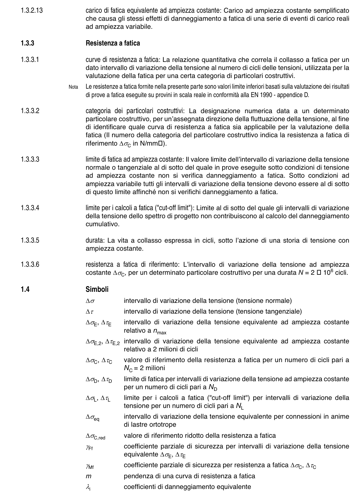

# 1 — Generalità, definizioni e simboli — pagina PDF 11

Fonte: [UNI EN 1993-1-9:2005 — Fatica](../../sources/ec3.pdf#page=11). Pagina stampata: 6.

> Formule, simboli e associazioni delle tabelle non sono convalidati per il calcolo.

## Testo estratto

```text
1.3.2.13                carico di fatica equivalente ad ampiezza costante: Carico ad ampiezza costante semplificato
                  che causa gli stessi effetti di danneggiamento a fatica di una serie di eventi di carico reali
                 ad ampiezza variabile.
```

1.3.3                Resistenza a fatica

```text
1.3.3.1                curve di resistenza a fatica: La relazione quantitativa che correla il collasso a fatica per un
                    dato intervallo di variazione della tensione al numero di cicli delle tensioni, utilizzata per la
                     valutazione della fatica per una certa categoria di particolari costruttivi.
```

Nota   Le resistenze a fatica fornite nella presente parte sono valori limite inferiori basati sulla valutazione dei risultati di prove a fatica eseguite su provini in scala reale in conformità alla EN 1990 - appendice D.

```text
1.3.3.2                 categoria dei  particolari  costruttivi: La designazione numerica data a un determinato
                       particolare costruttivo, per un’assegnata direzione della fluttuazione della tensione, al fine
                         di identificare quale curva di resistenza a fatica sia applicabile per la valutazione della
                        fatica (Il numero della categoria del particolare costruttivo indica la resistenza a fatica di
                      riferimento ∆σC in N/mm  ).
```

```text
1.3.3.3                    limite di fatica ad ampiezza costante: Il valore limite dell’intervallo di variazione della tensione
                   normale o tangenziale al di sotto del quale in prove eseguite sotto condizioni di tensione
                 ad ampiezza costante non si verifica danneggiamento a fatica. Sotto condizioni ad
                  ampiezza variabile tutti gli intervalli di variazione della tensione devono essere al di sotto
                         di questo limite affinché non si verifichi danneggiamento a fatica.
```

```text
1.3.3.4                    limite per i calcoli a fatica ("cut-off limit"): Limite al di sotto del quale gli intervalli di variazione
                       della tensione dello spettro di progetto non contribuiscono al calcolo del danneggiamento
                     cumulativo.
```

1.3.3.5                 durata: La vita a collasso espressa in cicli, sotto l’azione di una storia di tensione con ampiezza costante.

1.3.3.6                 resistenza a fatica di riferimento: L’intervallo di variazione della tensione ad ampiezza costante ∆σC, per un determinato particolare costruttivo per una durata N = 2   106 cicli.

1.4                 Simboli

∆σ           intervallo di variazione della tensione (tensione normale)

```text
               ∆τ           intervallo di variazione della tensione (tensione tangenziale)
                   ∆σE, ∆τE     intervallo di variazione della tensione equivalente ad ampiezza costante
                                      relativo a nmax
                      ∆σE,2, ∆τE,2  intervallo di variazione della tensione equivalente ad ampiezza costante
                                      relativo a 2 milioni di cicli
                   ∆σC, ∆τC    valore di riferimento della resistenza a fatica per un numero di cicli pari a
                        NC = 2 milioni
                   ∆σD, ∆τD     limite di fatica per intervalli di variazione della tensione ad ampiezza costante
                                per un numero di cicli pari a ND
                    ∆σL, ∆τL     limite per  i calcoli a fatica ("cut-off limit") per intervalli di variazione della
                                tensione per un numero di cicli pari a NL
                   ∆σeq         intervallo di variazione della tensione equivalente per connessioni in anime
                                        di lastre ortotrope
```

```text
                       ∆σC,red      valore di riferimento ridotto della resistenza a fatica
                         γFf           coefficiente parziale di sicurezza per intervalli di variazione della tensione
                                 equivalente ∆σE, ∆τE
                      γMf           coefficiente parziale di sicurezza per resistenza a fatica ∆σC, ∆τC
            m         pendenza di una curva di resistenza a fatica
```

λi            coefficienti di danneggiamento equivalente

## Pagina di riscontro


