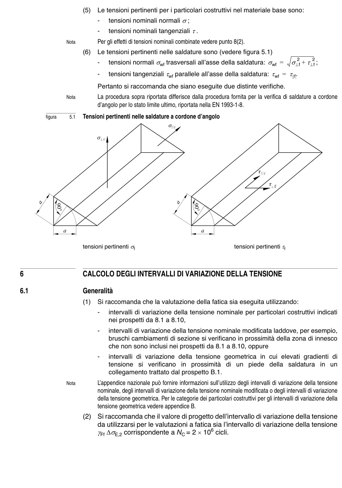

# 4–6 — Azioni e calcolo delle tensioni — pagina PDF 15

Fonte: [UNI EN 1993-1-9:2005 — Fatica](../../sources/ec3.pdf#page=15). Pagina stampata: 10.

> Formule, simboli e associazioni delle tabelle non sono convalidati per il calcolo.

## Testo estratto

(5)  Le tensioni pertinenti per i particolari costruttivi nel materiale base sono:

-   tensioni nominali normali σ ;

-   tensioni nominali tangenziali τ.

Nota        Per gli effetti di tensioni nominali combinate vedere punto 8(2).

```text
                        (6)  Le tensioni pertinenti nelle saldature sono (vedere figura 5.1)
                                    -   tensioni normali σwf trasversali all’asse della saldatura: σwf =  σ⊥f2 + τ⊥f2 ;
                                    -   tensioni tangenziali τwf parallele all’asse della saldatura: τwf = τ|f|〉.
```

Pertanto si raccomanda che siano eseguite due distinte verifiche.

Nota       La procedura sopra riportata differisce dalla procedura fornita per la verifica di saldature a cordone d’angolo per lo stato limite ultimo, riportata nella EN 1993-1-8.

figura       5.1   Tensioni pertinenti nelle saldature a cordone d’angolo

tensioni pertinenti σf                                       tensioni pertinenti τf

6             CALCOLO DEGLI INTERVALLI DI VARIAZIONE DELLA TENSIONE

6.1                  Generalità

(1)  Si raccomanda che la valutazione della fatica sia eseguita utilizzando:

-    intervalli di variazione della tensione nominale per particolari costruttivi indicati nei prospetti da 8.1 a 8.10,

```text
                                    -    intervalli di variazione della tensione nominale modificata laddove, per esempio,
                              bruschi cambiamenti di sezione si verificano in prossimità della zona di innesco
                         che non sono inclusi nei prospetti da 8.1 a 8.10, oppure
```

```text
                                    -    intervalli di variazione della tensione geometrica in cui elevati gradienti di
                             tensione  si  verificano  in  prossimità  di un  piede  della  saldatura  in un
                           collegamento trattato dal prospetto B.1.
```

```text
                     Nota         L’appendice nazionale può fornire informazioni sull’utilizzo degli intervalli di variazione della tensione
                              nominale, degli intervalli di variazione della tensione nominale modificata o degli intervalli di variazione
                                  della tensione geometrica. Per le categorie dei particolari costruttivi per gli intervalli di variazione della
                               tensione geometrica vedere appendice B.
```

```text
                       (2)  Si raccomanda che il valore di progetto dell’intervallo di variazione della tensione
                    da utilizzarsi per le valutazioni a fatica sia l’intervallo di variazione della tensione
                              γFf ∆σE,2 corrispondente a NC = 2 × 106 cicli.
```

## Pagina di riscontro


