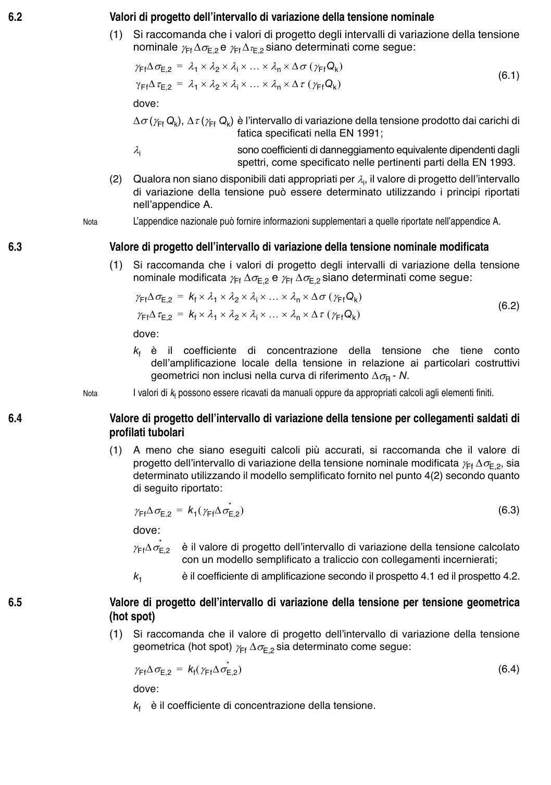

# 4–6 — Azioni e calcolo delle tensioni — pagina PDF 16

Fonte: [UNI EN 1993-1-9:2005 — Fatica](../../sources/ec3.pdf#page=16). Pagina stampata: 11.

> Formule, simboli e associazioni delle tabelle non sono convalidati per il calcolo.

## Testo estratto

6.2                    Valori di progetto dell’intervallo di variazione della tensione nominale

```text
                       (1)  Si raccomanda che i valori di progetto degli intervalli di variazione della tensione
                      nominale γFf ∆σE,2 e γFf ∆τE,2 siano determinati come segue:
                          γFf∆σE,2 = λ1 × λ2 × λi × ... × λn × ∆σ (γFfQk )
                                                                                                                  (6.1)
                             γFf∆τE,2 = λ1 × λ2 × λi × ... × λn × ∆τ (γFfQk )
```

dove: ∆σ(γFf Qk), ∆τ(γFf Qk) è l’intervallo di variazione della tensione prodotto dai carichi di fatica specificati nella EN 1991;

λi                 sono coefficienti di danneggiamento equivalente dipendenti dagli spettri, come specificato nelle pertinenti parti della EN 1993.

```text
                        (2)  Qualora non siano disponibili dati appropriati per λi, il valore di progetto dell’intervallo
                               di variazione della tensione può essere determinato utilizzando  i principi riportati
                          nell’appendice A.
```

Nota         L’appendice nazionale può fornire informazioni supplementari a quelle riportate nell’appendice A.

6.3                  Valore di progetto dell’intervallo di variazione della tensione nominale modificata

```text
                       (1)  Si raccomanda che  i valori di progetto degli intervalli di variazione della tensione
                       nominale modificata γFf ∆σE,2 e γFf ∆σE,2 siano determinati come segue:
                          γFf∆σE,2 = kf × λ1 × λ2 × λi × ... × λn × ∆σ (γFfQk )
                                                                                                                  (6.2)
                            γFf∆τE,2 = kf × λ1 × λ2 × λi × ... × λn × ∆τ (γFfQk )
```

```text
                        dove:
                                  kf  è     il  coefficiente   di  concentrazione  della  tensione  che  tiene  conto
                                dell’amplificazione locale della tensione in relazione ai particolari costruttivi
                              geometrici non inclusi nella curva di riferimento ∆σR - N.
                     Nota               I valori di kf possono essere ricavati da manuali oppure da appropriati calcoli agli elementi finiti.
```

6.4                  Valore di progetto dell’intervallo di variazione della tensione per collegamenti saldati di profilati tubolari

```text
                        (1)  A meno che siano eseguiti calcoli più accurati, si raccomanda che  il valore di
                          progetto dell’intervallo di variazione della tensione nominale modificata γFf ∆σE,2, sia
                         determinato utilizzando il modello semplificato fornito nel punto 4(2) secondo quanto
                               di seguito riportato:
```

γFf∆σE,2 = k1 (γFf∆σE,2*   )                                                           (6.3)

```text
                       dove:
                                                     *
                          γFf∆σE,2  è il valore di progetto dell’intervallo di variazione della tensione calcolato
                               con un modello semplificato a traliccio con collegamenti incernierati;
                           k1       è il coefficiente di amplificazione secondo il prospetto 4.1 ed il prospetto 4.2.
```

6.5                  Valore di progetto dell’intervallo di variazione della tensione per tensione geometrica (hot spot)

```text
                       (1)  Si raccomanda che  il valore di progetto dell’intervallo di variazione della tensione
                        geometrica (hot spot) γFf ∆σE,2 sia determinato come segue:
                          γFf∆σE,2 = kf (γFf∆σE,2*   )                                                            (6.4)
```

dove: kf  è il coefficiente di concentrazione della tensione.

## Pagina di riscontro


