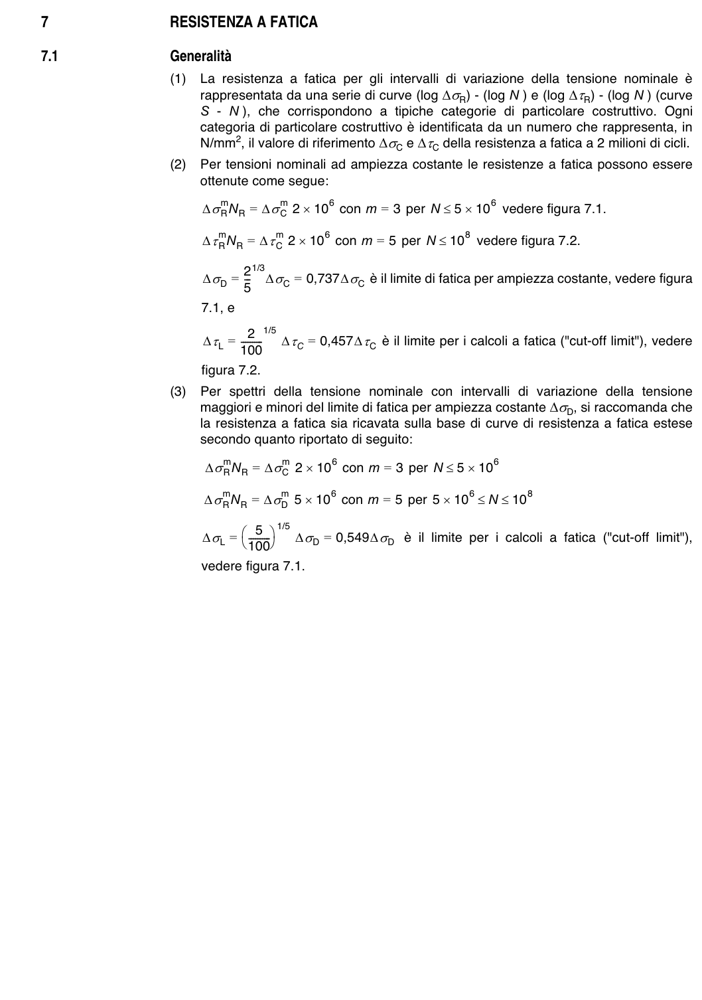

# 7–8 — Resistenza e verifiche a fatica — pagina PDF 17

Fonte: [UNI EN 1993-1-9:2005 — Fatica](../../sources/ec3.pdf#page=17). Pagina stampata: 12.

> Formule, simboli e associazioni delle tabelle non sono convalidati per il calcolo.

## Testo estratto

7               RESISTENZA A FATICA

7.1                  Generalità

```text
                        (1)  La resistenza a fatica per  gli intervalli di variazione della tensione nominale è
                         rappresentata da una serie di curve (log ∆σR) - (log N ) e (log ∆τR) - (log N ) (curve
                  S  - N ), che corrispondono a tipiche categorie di particolare costruttivo. Ogni
                          categoria di particolare costruttivo è identificata da un numero che rappresenta, in
                     N/mm2, il valore di riferimento ∆σC e ∆τC della resistenza a fatica a 2 milioni di cicli.
                        (2)  Per tensioni nominali ad ampiezza costante le resistenze a fatica possono essere
                          ottenute come segue:
```

∆σRmNR = ∆σCm 2 × 106 con m = 3 per N ≤ 5 × 106 vedere figura 7.1.

∆τRmNR = ∆τCm 2 × 106 con m = 5 per N ≤ 10 8 vedere figura 7.2.

```text
                           2 1/3
                    ∆σD =  5--  ∆σC = 0,737∆σC è il limite di fatica per ampiezza costante, vedere figura
                             7.1, e
```

```text
                            2  1/5
                        ∆τL =  ---------   ∆τC = 0,457∆τC è il limite per i calcoli a fatica ("cut-off limit"), vedere                           100
                             figura 7.2.
```

```text
                        (3)  Per  spettri della tensione nominale con  intervalli  di variazione della tensione
                         maggiori e minori del limite di fatica per ampiezza costante ∆σD, si raccomanda che
                               la resistenza a fatica sia ricavata sulla base di curve di resistenza a fatica estese
                      secondo quanto riportato di seguito:
```

∆σRmNR = ∆σCm 2 × 106 con m = 3 per N ≤ 5 × 106

∆σRmNR = ∆σDm 5 × 106 con m = 5 per 5 × 106 ≤ N ≤ 108

∆σL =                                        ---------5  1/5 ∆σD = 0,549∆σD è  il limite per  i calcoli a fatica ("cut-off  limit"),                                        100 vedere figura 7.1.

## Pagina di riscontro


