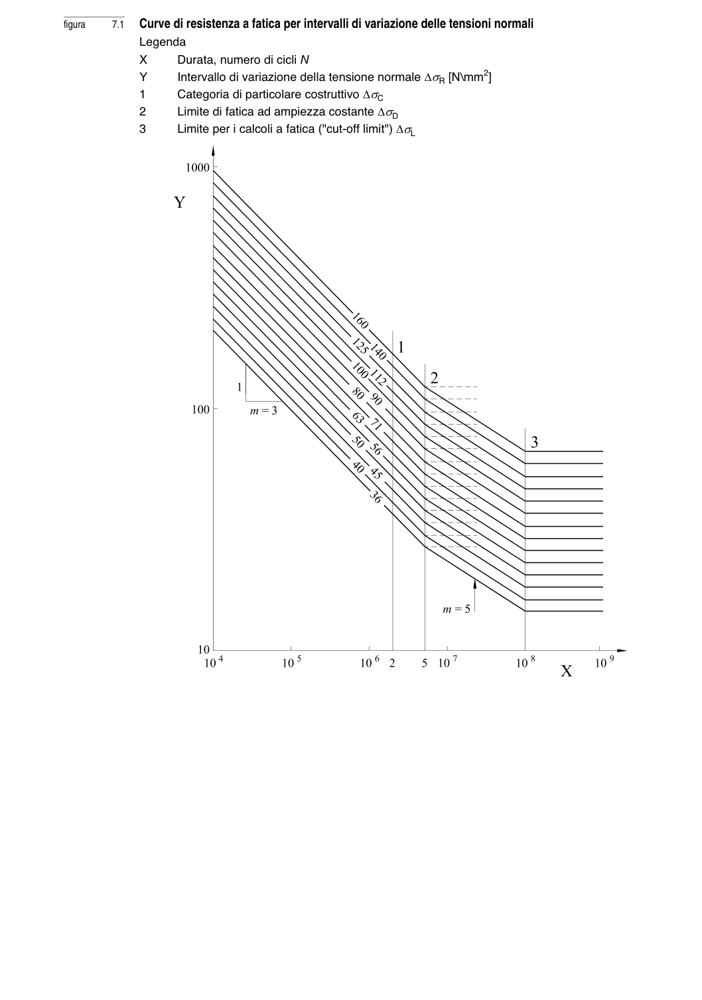

# 7–8 — Resistenza e verifiche a fatica — pagina PDF 18

Fonte: [UNI EN 1993-1-9:2005 — Fatica](../../sources/ec3.pdf#page=18). Pagina stampata: 13.

> Formule, simboli e associazioni delle tabelle non sono convalidati per il calcolo.

## Testo estratto

```text
figura       7.1  Curve di resistenza a fatica per intervalli di variazione delle tensioni normali
           Legenda
         X     Durata, numero di cicli N
         Y      Intervallo di variazione della tensione normale ∆σR [N\mm2]
           1     Categoria di particolare costruttivo ∆σC
           2      Limite di fatica ad ampiezza costante ∆σD
           3      Limite per i calcoli a fatica ("cut-off limit") ∆σL
```

## Pagina di riscontro


