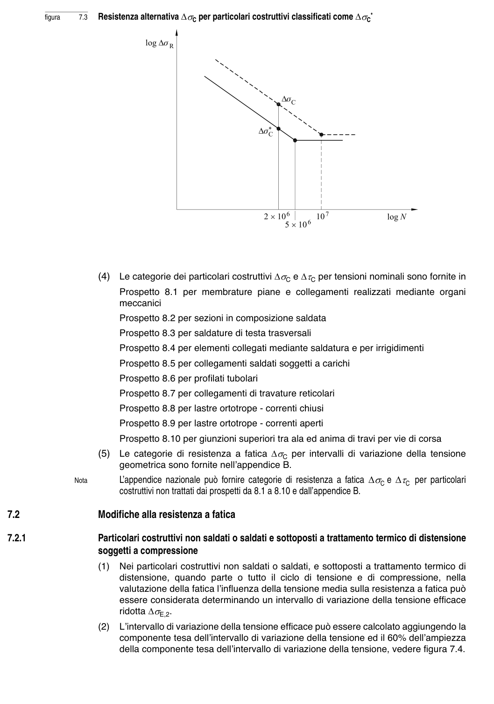

# 7–8 — Resistenza e verifiche a fatica — pagina PDF 20

Fonte: [UNI EN 1993-1-9:2005 — Fatica](../../sources/ec3.pdf#page=20). Pagina stampata: 15.

> Formule, simboli e associazioni delle tabelle non sono convalidati per il calcolo.

## Testo estratto

figura       7.3   Resistenza alternativa ∆σC per particolari costruttivi classificati come ∆σC*

```text
                       (4)  Le categorie dei particolari costruttivi ∆σC e ∆τC per tensioni nominali sono fornite in
                         Prospetto 8.1 per membrature piane e collegamenti realizzati mediante organi
                        meccanici
```

Prospetto 8.2 per sezioni in composizione saldata

Prospetto 8.3 per saldature di testa trasversali

Prospetto 8.4 per elementi collegati mediante saldatura e per irrigidimenti

Prospetto 8.5 per collegamenti saldati soggetti a carichi

Prospetto 8.6 per profilati tubolari

Prospetto 8.7 per collegamenti di travature reticolari

Prospetto 8.8 per lastre ortotrope - correnti chiusi

Prospetto 8.9 per lastre ortotrope - correnti aperti

```text
                         Prospetto 8.10 per giunzioni superiori tra ala ed anima di travi per vie di corsa
                       (5)  Le categorie di resistenza a fatica ∆σC per intervalli di variazione della tensione
                        geometrica sono fornite nell’appendice B.
                     Nota        L’appendice nazionale può fornire categorie di resistenza a fatica ∆σC e ∆τC per particolari
                                    costruttivi non trattati dai prospetti da 8.1 a 8.10 e dall’appendice B.
```

7.2                 Modifiche alla resistenza a fatica

7.2.1                   Particolari costruttivi non saldati o saldati e sottoposti a trattamento termico di distensione soggetti a compressione

```text
                        (1)  Nei particolari costruttivi non saldati o saldati, e sottoposti a trattamento termico di
                           distensione, quando parte o tutto  il ciclo di tensione e di compressione, nella
                          valutazione della fatica l’influenza della tensione media sulla resistenza a fatica può
                        essere considerata determinando un intervallo di variazione della tensione efficace
                              ridotta ∆σE,2.
                        (2)   L’intervallo di variazione della tensione efficace può essere calcolato aggiungendo la
                      componente tesa dell’intervallo di variazione della tensione ed il 60% dell’ampiezza
                            della componente tesa dell’intervallo di variazione della tensione, vedere figura 7.4.
```

## Pagina di riscontro


