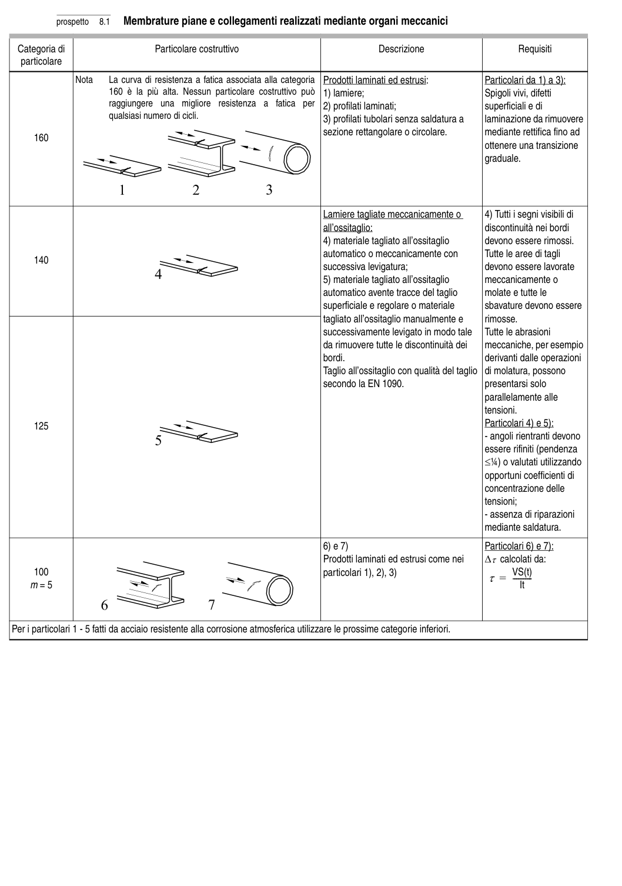

# 8 — Catalogo dei particolari costruttivi — pagina PDF 22

Fonte: [UNI EN 1993-1-9:2005 — Fatica](../../sources/ec3.pdf#page=22). Pagina stampata: 17.

> Formule, simboli e associazioni delle tabelle non sono convalidati per il calcolo.

## Testo estratto

prospetto   8.1  Membrature piane e collegamenti realizzati mediante organi meccanici

Categoria di                        Particolare costruttivo                                  Descrizione                         Requisiti particolare

```text
               Nota    La curva di resistenza a fatica associata alla categoria  Prodotti laminati ed estrusi:                Particolari da 1) a 3):
                     160 è la più alta. Nessun particolare costruttivo può  1) lamiere;                                Spigoli vivi, difetti
                        raggiungere  una  migliore  resistenza  a  fatica  per  2) profilati laminati;                          superficiali e di
                           qualsiasi numero di cicli.                                3) profilati tubolari senza saldatura a     laminazione da rimuovere
                                                                        sezione rettangolare o circolare.        mediante rettifica fino ad
     160
                                                                                                                      ottenere una transizione
                                                                                                                      graduale.
```

```text
                                                                     Lamiere tagliate meccanicamente o      4) Tutti i segni visibili di
                                                                                              all’ossitaglio:                              discontinuità nei bordi
                                                                                4) materiale tagliato all’ossitaglio        devono essere rimossi.
                                                                         automatico o meccanicamente con       Tutte le aree di tagli
     140
                                                                         successiva levigatura;                devono essere lavorate
                                                                                5) materiale tagliato all’ossitaglio        meccanicamente o
                                                                         automatico avente tracce del taglio      molate e tutte le
                                                                                     superficiale e regolare o materiale       sbavature devono essere
                                                                                        tagliato all’ossitaglio manualmente e     rimosse.
                                                                      successivamente levigato in modo tale   Tutte le abrasioni
                                                                da rimuovere tutte le discontinuità dei    meccaniche, per esempio
                                                                                      bordi.                                      derivanti dalle operazioni
                                                                                  Taglio all’ossitaglio con qualità del taglio  di molatura, possono
                                                                  secondo la EN 1090.                     presentarsi solo
                                                                                                                    parallelamente alle
                                                                                                                                   tensioni.
     125                                                                                                                           Particolari 4) e 5):
                                                                                                                                                                   - angoli rientranti devono
                                                                                                            essere rifiniti (pendenza
                                                                                        ≤1⁄4) o valutati utilizzando
                                                                                                                    opportuni coefficienti di
                                                                                                                concentrazione delle
                                                                                                                                   tensioni;
                                                                                                                                                                   - assenza di riparazioni
                                                                                                         mediante saldatura.
```

```text
                                                                                6) e 7)                                      Particolari 6) e 7):
                                                                                   Prodotti laminati ed estrusi come nei   ∆τ calcolati da:
     100                                                                               particolari 1), 2), 3)                             VS(t)
                                                   τ =   ----------
   m = 5                                                                                                                                                                                                 It
```

Per i particolari 1 - 5 fatti da acciaio resistente alla corrosione atmosferica utilizzare le prossime categorie inferiori.

## Tabelle e dettagli

- [ec3-022-t01-d01-01](../details/ec3-022-t01-d01-01.md) — 160
- [ec3-022-t01-d01-02](../details/ec3-022-t01-d01-02.md) — 160
- [ec3-022-t01-d01-03](../details/ec3-022-t01-d01-03.md) — 160
- [ec3-022-t01-d02](../details/ec3-022-t01-d02.md) — 140
- [ec3-022-t01-d03](../details/ec3-022-t01-d03.md) — 125
- [ec3-022-t01-d04-01](../details/ec3-022-t01-d04-01.md) — 100; m = 5
- [ec3-022-t01-d04-02](../details/ec3-022-t01-d04-02.md) — 100; m = 5

## Pagina di riscontro


