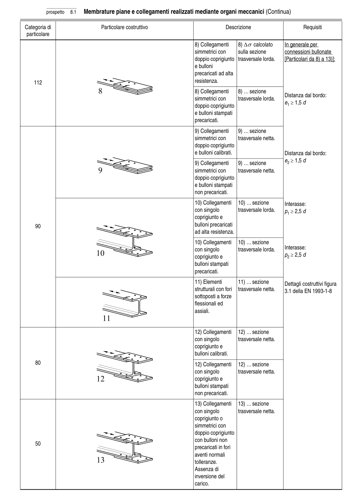

# 8 — Catalogo dei particolari costruttivi — pagina PDF 23

Fonte: [UNI EN 1993-1-9:2005 — Fatica](../../sources/ec3.pdf#page=23). Pagina stampata: 18.

> Formule, simboli e associazioni delle tabelle non sono convalidati per il calcolo.

## Testo estratto

prospetto   8.1  Membrature piane e collegamenti realizzati mediante organi meccanici (Continua)

Categoria di                        Particolare costruttivo                                  Descrizione                         Requisiti particolare

```text
                                                                              8) Collegamenti    8) ∆σ calcolato      In generale per
                                                                              simmetrici con      sulla sezione        connessioni bullonate
                                                                      doppio coprigiunto  trasversale lorda.     [Particolari da 8) a 13)]:
                                                               e bulloni
                                                                                   precaricati ad alta
   112                                                                        resistenza.
```

```text
                                                                              8) Collegamenti    8) ... sezione
                                                                                                              Distanza dal bordo:
                                                                              simmetrici con      trasversale lorda.
                                                                                                                e1 ≥ 1,5 d                                                                      doppio coprigiunto
                                                               e bulloni stampati
                                                                                      precaricati.
```

```text
                                                                              9) Collegamenti    9) ... sezione
                                                                              simmetrici con      trasversale netta.
                                                                      doppio coprigiunto
                                                               e bulloni calibrati.                      Distanza dal bordo:
                                                                              9) Collegamenti    9) ... sezione        e2 ≥ 1,5 d
                                                                              simmetrici con      trasversale netta.
                                                                      doppio coprigiunto
                                                               e bulloni stampati
                                                               non precaricati.
```

```text
                                                                        10) Collegamenti   10) ... sezione       Interasse:
                                                                 con singolo         trasversale lorda.    p1 ≥ 2,5 d
                                                                              coprigiunto e
    90                                                                             bulloni precaricati
                                                               ad alta resistenza.
```

```text
                                                                        10) Collegamenti   10) ... sezione
                                                                                                                          Interasse:                                                                 con singolo         trasversale lorda.
                                                                              coprigiunto e                           p2 ≥ 2,5 d
                                                                                     bulloni stampati
                                                                                      precaricati.
```

```text
                                                                        11) Elementi       11) ... sezione        Dettagli costruttivi figura
                                                                                             strutturali con fori   trasversale netta.    3.1 della EN 1993-1-8
                                                                                  sottoposti a forze
                                                                                        flessionali ed
                                                                                            assiali.
```

```text
                                                                        12) Collegamenti   12) ... sezione
                                                                 con singolo         trasversale netta.
                                                                              coprigiunto e
                                                                                     bulloni calibrati.
    80                                                                  12) Collegamenti   12) ... sezione
                                                                 con singolo         trasversale netta.
                                                                              coprigiunto e
                                                                                     bulloni stampati
                                                               non precaricati.
```

```text
                                                                        13) Collegamenti   13) ... sezione
                                                                 con singolo         trasversale netta.
                                                                              coprigiunto o
                                                                              simmetrici con
                                                                      doppio coprigiunto
                                                                 con bulloni non
    50
                                                                                   precaricati in fori
                                                                                aventi normali
                                                                                    tolleranze.
                                                                Assenza di
                                                                              inversione del
                                                                                    carico.
```

## Tabelle e dettagli

- [ec3-023-t01-d01](../details/ec3-023-t01-d01.md) — 112
- [ec3-023-t01-d02](../details/ec3-023-t01-d02.md) — 90
- [ec3-023-t01-d03](../details/ec3-023-t01-d03.md) — 90
- [ec3-023-t01-d04](../details/ec3-023-t01-d04.md) — 90
- [ec3-023-t01-d05](../details/ec3-023-t01-d05.md) — 80
- [ec3-023-t01-d06](../details/ec3-023-t01-d06.md) — 50

## Pagina di riscontro


